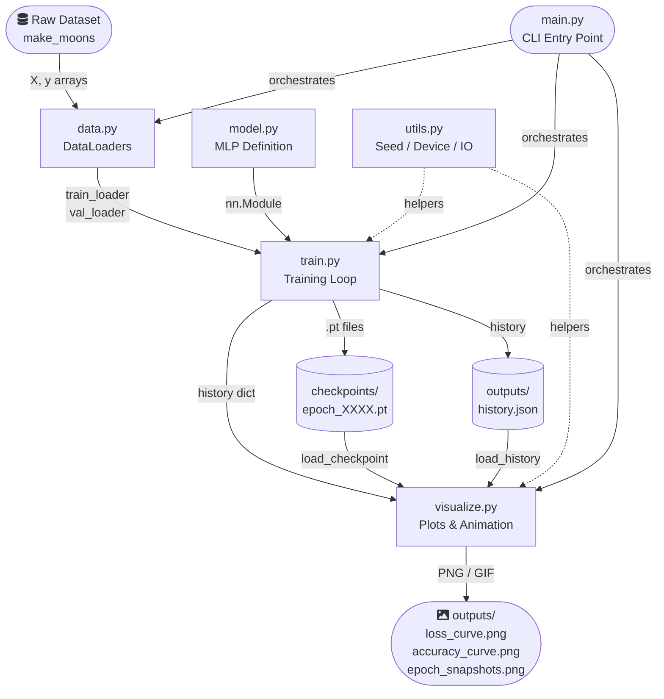
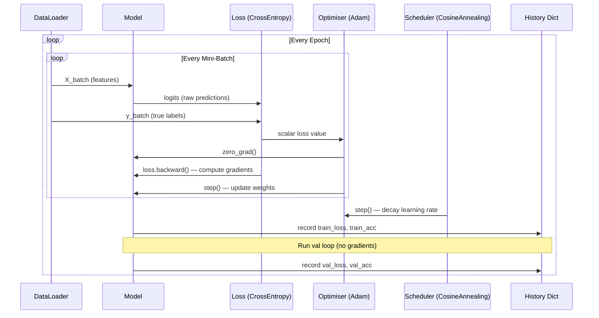
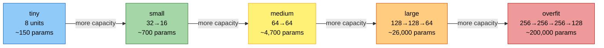
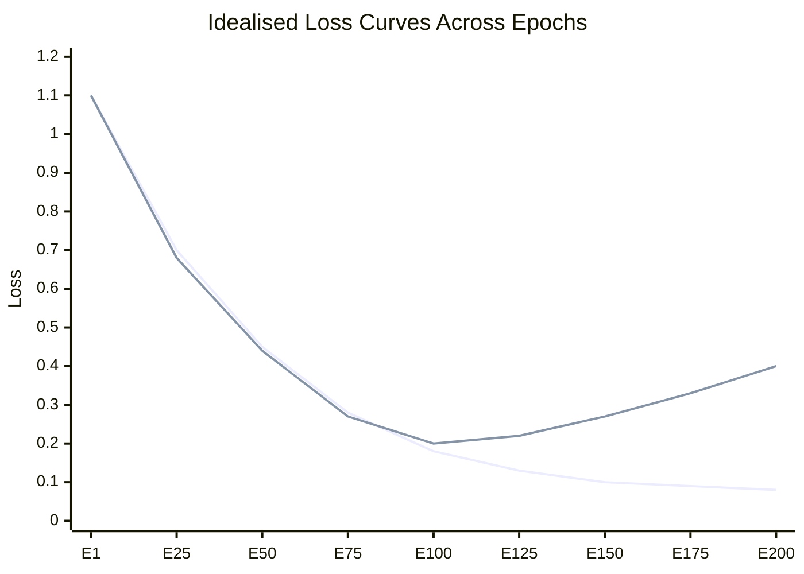

# 🧠 Epochs Demo — Understanding Training Epochs in PyTorch


> A complete, runnable machine-learning project that **visually demonstrates** what training epochs are, why they matter, how they drive a model from random noise to a learned decision boundary, and what happens when you use too few or too many of them.

---

## Table of Contents

- [What Is an Epoch?](#what-is-an-epoch)
- [Why Are Multiple Epochs Needed?](#why-are-multiple-epochs-needed)
- [The Four Phases of Training](#the-four-phases-of-training)
- [Tech Stack and Architecture](#tech-stack-and-architecture)
- [Project Structure](#project-structure)
- [Module Reference](#module-reference)
- [Quick Start](#quick-start)
- [CLI Options](#cli-options)
- [Generated Outputs](#generated-outputs)
- [How to Interpret the Visualizations](#how-to-interpret-the-visualizations)
- [Dataset Details](#dataset-details)
- [Model Capacity Presets](#model-capacity-presets)
- [Experiments Guide](#experiments-guide)
- [Dependencies](#dependencies)
- [Troubleshooting](#troubleshooting)
- [Glossary of Terms](#glossary-of-terms)

---

## What Is an Epoch?

An **epoch** is one complete, sequential pass through the entire training dataset. During a single epoch, the model is presented with every training sample exactly once, in **mini-batches** — small subsets of the full dataset that are processed together. For each mini-batch the model computes a **forward pass** (feeding inputs through the network to produce predictions), measures its error using a **loss function** (cross-entropy in this project, which quantifies how far the predicted probabilities are from the true labels), runs a **backward pass** to compute **gradients** (the direction and magnitude in which each weight should change to reduce the loss), and then updates its weights using the chosen **optimiser** (Adam, which adapts the learning rate individually for each parameter). After all mini-batches in the dataset have been processed, one epoch is complete.

The concept of an epoch is fundamental because neural networks do not — and cannot — learn everything they need to know from a single pass over the data. **Gradient descent** is an iterative optimisation algorithm: each step moves the weights only a small distance in the direction that reduces the loss. A single epoch gives the model one round of feedback from every sample. Repeating this process over many epochs allows the model to progressively refine its internal representations, correct past mistakes, and **converge** toward a stable, low-loss solution where the weights no longer change significantly from epoch to epoch.

> [!NOTE]
> An epoch is **not** the same as a gradient update step. A **gradient update step** (also called an iteration) happens once per mini-batch — the weights are adjusted after seeing just `batch_size` samples. An epoch contains many gradient steps. If your dataset has 1,000 samples and you use a batch size of 64, each epoch contains approximately 16 gradient update steps. The number of updates per epoch scales with `ceil(n_samples / batch_size)`.

---

## Why Are Multiple Epochs Needed?

When a neural network is first initialised, its weights are assigned small random values. This means the model's initial predictions are essentially random guesses — the **loss** is high and there is no meaningful structure in what the network outputs. After the first epoch, the model has seen every training sample once and has nudged its weights in the right direction through backpropagation — but a single epoch produces only small adjustments, and the model is still far from optimal.

Over successive epochs, the model experiences the same data from different random mini-batch orderings (because `shuffle=True` in the DataLoader). This **stochastic shuffling** is healthy: it introduces variability in the gradient estimates so the optimiser does not get stuck following the exact same path every epoch, and it prevents the model from memorising the sequence of training examples rather than their content. The **cosine annealing learning-rate scheduler** used in this project gradually reduces the learning rate following a cosine curve over all epochs — allowing large, exploratory weight updates early in training when the model is far from its optimum, and progressively smaller, fine-grained adjustments later when the model is close to convergence and large steps would overshoot.

> [!IMPORTANT]
> Training for **too few** epochs leaves the model in an **underfitted** state — it has not yet discovered the underlying pattern in the data and will perform poorly on both training and validation data because its weights have not been sufficiently adjusted away from their random initialisation. Training for **too many** epochs causes the model to memorise training-set noise rather than the true signal, a phenomenon called **overfitting**, where training accuracy keeps rising but validation accuracy plateaus or falls because the model has specialised too tightly to the exact examples it was trained on.

The central tension between underfitting and overfitting — known as the **bias-variance tradeoff** — makes epoch selection one of the most critical **hyperparameter** decisions in deep learning. A hyperparameter is any configuration value that is set before training begins and is not learned from the data itself; epoch count, learning rate, and batch size are all hyperparameters. This project exists to make that tension visible and measurable.

---

## The Four Phases of Training

As epochs increase, every model passes through four recognisable phases. Understanding which phase you are in — by reading the loss and accuracy curves — is the core skill this project teaches.

| # | Phase | Epoch Range | Train Loss | Val Loss | Train Acc | Val Acc | Verdict |
|---|---|---|---|---|---|---|---|
| <sub>1</sub> | <sub>Underfitting</sub> | <sub>First ~10-20%</sub> | <sub>High, falling fast</sub> | <sub>High, falling fast</sub> | <sub>Low</sub> | <sub>Low</sub> | <sub>Keep training - model is still learning basics</sub> |
| <sub>2</sub> | <sub>Learning</sub> | <sub>20% - 50%</sub> | <sub>Falling steadily</sub> | <sub>Falling steadily</sub> | <sub>Rising</sub> | <sub>Rising</sub> | <sub>Healthy - both splits improving together</sub> |
| <sub>3</sub> | <sub>Convergence</sub> | <sub>50% - 75%</sub> | <sub>Low and slowing</sub> | <sub>Low, near-stable</sub> | <sub>Near peak</sub> | <sub>Near peak</sub> | <sub>Optimal - best generalisation lives here</sub> |
| <sub>4</sub> | <sub>Overfitting</sub> | <sub>75% +</sub> | <sub>Still falling slightly</sub> | <sub>Rising</sub> | <sub>Still rising</sub> | <sub>Falling</sub> | <sub>Danger zone - model memorising noise</sub> |

> [!WARNING]
> The exact epoch at which each phase begins depends heavily on your model capacity, learning rate, dataset size, and noise level. There is no universal number. Always monitor validation loss — not training loss — to make decisions about when to stop.

---

## Tech Stack and Architecture

This project is built on a carefully chosen stack that balances simplicity, speed, and educational clarity. Every library was selected because it is the industry standard for its role and requires minimal boilerplate.

### Technology Choices

| Layer | Library | Version | Why It Was Chosen |
|---|---|---|---|
| <sub>Deep Learning</sub> | <sub>PyTorch</sub> | <sub>2.0+</sub> | <sub>Dynamic computation graph, intuitive API, industry-standard for research and production</sub> |
| <sub>Dataset Generation</sub> | <sub>scikit-learn</sub> | <sub>1.3+</sub> | <sub>make_moons produces a non-linear 2-D boundary that makes epoch effects visually obvious</sub> |
| <sub>Numerical Arrays</sub> | <sub>NumPy</sub> | <sub>1.24+</sub> | <sub>Bridge between scikit-learn arrays and PyTorch tensors; meshgrid for decision boundary plots</sub> |
| <sub>Visualisation</sub> | <sub>Matplotlib</sub> | <sub>3.7+</sub> | <sub>Full control over every plot element; PillowWriter for GIF animation export</sub> |
| <sub>Progress Bars</sub> | <sub>tqdm</sub> | <sub>4.65+</sub> | <sub>Live per-epoch metrics in the terminal without custom logging boilerplate</sub> |
| <sub>Interactive Analysis</sub> | <sub>Jupyter</sub> | <sub>1.0+</sub> | <sub>Notebook for post-hoc exploration of saved history and checkpoint comparison</sub> |

### System Architecture

The project follows a clean pipeline architecture where each module has a single, well-defined responsibility. Data flows in one direction: from raw arrays through training to persisted artifacts, then into visualisation. No module has circular dependencies.



### Training Loop Internals

The training loop in `train.py` executes the following sequence every epoch. Understanding this cycle is essential for understanding what "more epochs" actually means at a mechanical level.



### Decision Boundary Generation

Producing a decision boundary plot requires running inference on a dense grid of points covering the feature space. The grid is constructed, passed through the model, and the resulting probabilities are reshaped into a 2-D array for `contourf`.


### Model Capacity Spectrum

The five model presets span a wide range of expressiveness. A "tiny" model has so few parameters it cannot represent the moon boundary regardless of epoch count — a structural underfitting case. The "overfit" model has far more parameters than needed and will memorise noise given enough epochs.



### Epoch Effect Summary

This diagram shows how the relationship between train and validation metrics changes across the four training phases.



> [!TIP]
> The xychart above shows an **idealised** loss trajectory. In practice the curves are noisier, especially early in training. Smooth curves are a sign of a sufficiently large batch size and a well-tuned learning rate.

---

## Project Structure

```
epochs-demo/
├── README.md                    ← This file
├── CONTRIBUTING.md              ← Contribution workflow and expectations
├── .gitignore                   ← Git exclusions for local and generated files
├── .github/                     ← GitHub issue and pull request templates
│   ├── ISSUE_TEMPLATE/
│   │   ├── bug_report.yml
│   │   ├── feature_request.yml
│   │   └── config.yml
│   └── PULL_REQUEST_TEMPLATE.md
├── requirements.txt             ← Pinned dependency list
├── .venv/                       ← Virtual environment (not committed)
│
├── src/                         ← All source code
│   ├── data.py                  ← Dataset generation and DataLoader creation
│   ├── model.py                 ← MLP architecture + capacity factory
│   ├── train.py                 ← Training loop with checkpointing
│   ├── evaluate.py              ← Post-training metrics and report
│   ├── visualize.py             ← All plotting and animation functions
│   ├── utils.py                 ← Seeding, device detection, checkpoint I/O
│   └── main.py                  ← CLI entry-point that wires everything together
│
├── notebooks/
│   └── epoch_analysis.ipynb     ← Interactive Jupyter analysis
│
├── checkpoints/                 ← Auto-created: .pt weight files per epoch
│   ├── epoch_0001.pt
│   ├── epoch_0050.pt
│   └── ...
│
└── outputs/                     ← Auto-created: all generated plots
    ├── loss_curve.png
    ├── accuracy_curve.png
    ├── boundary_epoch_XXXX.png
    ├── epoch_snapshots.png
    ├── training_animation.gif   ← Only with --animate
    └── history.json
```

---

## Module Reference

<details>
<summary><strong>📦 src/data.py — Dataset Generation</strong></summary>

`data.py` is responsible for generating the synthetic training data and packaging it into PyTorch `DataLoader` objects that the training loop can consume. It uses scikit-learn's `make_moons` function to produce a two-class, two-dimensional dataset where the optimal decision boundary is a smooth non-linear curve. This makes it ideal for visualising what the model has learned at any given epoch.

The module exposes two public functions:

| Function | Signature | Returns | Purpose |
|---|---|---|---|
| <sub>generate_dataset</sub> | <sub>n_samples, noise, random_state</sub> | <sub>(X: ndarray, y: ndarray)</sub> | <sub>Raw numpy arrays for the full dataset</sub> |
| <sub>get_dataloaders</sub> | <sub>n_samples, noise, batch_size, val_split, random_state</sub> | <sub>(train_loader, val_loader, X_all, y_all)</sub> | <sub>Ready-to-use DataLoaders plus raw arrays for visualisation</sub> |

The `val_split` parameter (default 0.20) controls what fraction of the data is held out for validation. The split is performed using PyTorch's `random_split` with a seeded generator, ensuring that the train/val partition is identical across every run as long as `random_state` is unchanged.

</details>

<details>
<summary><strong>🧱 src/model.py — MLP Architecture</strong></summary>

`model.py` defines the neural network architecture used throughout the project. The `MLP` class is a fully-connected feed-forward network where each hidden layer is followed by Batch Normalisation, a ReLU activation, and optional Dropout. Batch Normalisation stabilises training by normalising layer inputs, which allows higher learning rates and faster convergence. Dropout is a regularisation technique that randomly zeroes a fraction of activations during training, reducing the risk of overfitting.

The `build_model` factory function accepts a `capacity` string and returns a pre-configured `MLP`. This abstraction means `main.py` and the notebook never need to know the exact hidden sizes — they just request "medium" or "overfit" and get the right architecture.

| Preset | Hidden Layers | Dropout | Approx Params | Best Demonstrates |
|---|---|---|---|---|
| <sub>tiny</sub> | <sub>[8]</sub> | <sub>0.0</sub> | <sub>~150</sub> | <sub>Structural underfitting regardless of epochs</sub> |
| <sub>small</sub> | <sub>[32, 16]</sub> | <sub>0.0</sub> | <sub>~700</sub> | <sub>Mild underfitting with few epochs</sub> |
| <sub>medium</sub> | <sub>[64, 64]</sub> | <sub>0.1</sub> | <sub>~4,700</sub> | <sub>Balanced - converges cleanly, default preset</sub> |
| <sub>large</sub> | <sub>[128, 128, 64]</sub> | <sub>0.2</sub> | <sub>~26,000</sub> | <sub>Regularised high capacity, slow to overfit</sub> |
| <sub>overfit</sub> | <sub>[256, 256, 256, 128]</sub> | <sub>0.0</sub> | <sub>~200,000</sub> | <sub>Deliberately oversized, overfits rapidly</sub> |

</details>

<details>
<summary><strong>🔁 src/train.py — Training Loop</strong></summary>

`train.py` contains the core training logic. The `train` function executes `num_epochs` complete passes over the training data and returns a `history` dictionary containing four lists — `train_loss`, `val_loss`, `train_acc`, `val_acc` — each of length `num_epochs`. These lists are the primary data artifact of the project and power all downstream visualisations.

The internal `_run_epoch` helper is shared between training and validation passes. When `training=True`, it runs `optimizer.zero_grad()`, `loss.backward()`, and `optimizer.step()`. When `training=False`, it runs inside `torch.no_grad()` and skips all weight-update steps, which both saves memory and prevents gradient contamination of the validation pass.

The `save_epochs` parameter controls which epochs trigger a checkpoint save. By default, checkpoints are saved at epoch 1, 25%, 50%, 75%, and 100% of total training, giving five snapshots that span the full underfitting-to-overfitting spectrum.

</details>

<details>
<summary><strong>📊 src/visualize.py — Plotting and Animation</strong></summary>

`visualize.py` exposes five public plotting functions, each writing a PNG or GIF to the `outputs/` directory. All functions accept a `show=False` flag; set it to `True` for interactive display or leave it `False` for headless/scripted execution.

| Function | Output File | Description |
|---|---|---|
| <sub>plot_loss_curve</sub> | <sub>loss_curve.png</sub> | <sub>Train and val loss over all epochs with colour-coded phase regions</sub> |
| <sub>plot_accuracy_curve</sub> | <sub>accuracy_curve.png</sub> | <sub>Train and val accuracy over all epochs as percentages</sub> |
| <sub>plot_decision_boundary</sub> | <sub>boundary_epoch_XXXX.png</sub> | <sub>Contourf boundary for a single model at a single epoch</sub> |
| <sub>plot_epoch_snapshots</sub> | <sub>epoch_snapshots.png</sub> | <sub>Multi-panel grid comparing boundaries at all saved checkpoints</sub> |
| <sub>animate_training</sub> | <sub>training_animation.gif</sub> | <sub>Animated GIF cycling through all checkpoint boundaries</sub> |

Decision boundaries are computed by building a 300x300 meshgrid over the feature space, running all 90,000 grid points through the model in a single `torch.no_grad()` forward pass, and mapping the class-1 softmax probability to a colour scale.

</details>

<details>
<summary><strong>🛠️ src/utils.py — Shared Helpers</strong></summary>

`utils.py` provides five utility functions that are used by multiple modules. Centralising these prevents code duplication and ensures consistent behaviour across the codebase.

| Function | Purpose |
|---|---|
| <sub>seed_everything(seed)</sub> | <sub>Sets Python, NumPy, and PyTorch RNG seeds simultaneously for full reproducibility</sub> |
| <sub>get_device()</sub> | <sub>Returns the best available torch.device: CUDA > MPS (Apple Silicon) > CPU</sub> |
| <sub>save_checkpoint(model, epoch, metrics, dir)</sub> | <sub>Saves model state_dict plus epoch number and metric snapshot to a .pt file</sub> |
| <sub>load_checkpoint(model, path, device)</sub> | <sub>Loads weights from a .pt file into an existing model instance</sub> |
| <sub>save_history(history, dir)</sub> | <sub>Serialises the training history dict to history.json for notebook analysis</sub> |
| <sub>load_history(dir)</sub> | <sub>Deserialises history.json back into a Python dict for plotting</sub> |

</details>

---

## Quick Start

### Prerequisites

- Python 3.10 or later
- A terminal (bash, zsh, PowerShell, or Command Prompt)
- ~2 GB disk space for PyTorch installation

### Installation

```bash
# Clone or navigate to the project
cd /path/to/epochs-demo

# Create an isolated virtual environment
python -m venv .venv

# Activate it
source .venv/bin/activate          # Linux / macOS
# .venv\Scripts\activate           # Windows PowerShell

# Install all dependencies
pip install -r requirements.txt
```

### Run Training

```bash
# Standard run: 200 epochs, medium MLP, default settings
python src/main.py

# Generate boundary animation (requires Pillow, included in requirements)
python src/main.py --animate

# Demonstrate clear overfitting: big model, many epochs, low noise
python src/main.py --capacity overfit --epochs 500 --noise 0.05

# Demonstrate structural underfitting: model too small to learn
python src/main.py --capacity tiny --epochs 200

# Demonstrate epoch-count underfitting: capable model, too few epochs
python src/main.py --capacity medium --epochs 5

# Interactive display of plots as they are generated
python src/main.py --show-plots
```

### Run the Notebook

```bash
# Start Jupyter in the project root
jupyter notebook notebooks/epoch_analysis.ipynb
```

> [!TIP]
> Run `python src/main.py` at least once before opening the notebook. The notebook loads `outputs/history.json` and `checkpoints/*.pt` that are produced by the training script. Without them, several cells will raise `FileNotFoundError`.

---

## CLI Options

The `main.py` entry-point accepts the following command-line arguments. All arguments are optional and have sensible defaults that produce a complete, educational demonstration out of the box.

| Flag | Type | Default | Valid Range | Description |
|---|---|---|---|---|
| <sub>--epochs</sub> | <sub>int</sub> | <sub>200</sub> | <sub>1 - 10000</sub> | <sub>Total number of training epochs to run</sub> |
| <sub>--batch-size</sub> | <sub>int</sub> | <sub>64</sub> | <sub>1 - n_samples</sub> | <sub>Mini-batch size fed to the model per gradient step</sub> |
| <sub>--lr</sub> | <sub>float</sub> | <sub>0.01</sub> | <sub>1e-5 - 1.0</sub> | <sub>Initial learning rate for the Adam optimiser</sub> |
| <sub>--noise</sub> | <sub>float</sub> | <sub>0.20</sub> | <sub>0.0 - 1.0</sub> | <sub>Gaussian noise standard deviation on dataset labels</sub> |
| <sub>--n-samples</sub> | <sub>int</sub> | <sub>1000</sub> | <sub>100 - 100000</sub> | <sub>Total number of data points to generate</sub> |
| <sub>--capacity</sub> | <sub>str</sub> | <sub>medium</sub> | <sub>see presets</sub> | <sub>Model size preset: tiny / small / medium / large / overfit</sub> |
| <sub>--seed</sub> | <sub>int</sub> | <sub>42</sub> | <sub>any int</sub> | <sub>Master RNG seed for full reproducibility</sub> |
| <sub>--output-dir</sub> | <sub>str</sub> | <sub>outputs</sub> | <sub>any path</sub> | <sub>Directory where PNG and JSON artifacts are written</sub> |
| <sub>--ckpt-dir</sub> | <sub>str</sub> | <sub>checkpoints</sub> | <sub>any path</sub> | <sub>Directory where .pt checkpoint files are saved</sub> |
| <sub>--animate</sub> | <sub>flag</sub> | <sub>off</sub> | <sub>present / absent</sub> | <sub>If present, generate a GIF animation of boundary evolution</sub> |
| <sub>--show-plots</sub> | <sub>flag</sub> | <sub>off</sub> | <sub>present / absent</sub> | <sub>If present, open each plot in an interactive window</sub> |

---

## Generated Outputs

After a successful run, the `outputs/` directory contains the following files. Each file is self-contained and can be viewed independently.

| File | Size (approx) | Format | Description |
|---|---|---|---|
| <sub>loss_curve.png</sub> | <sub>60-80 KB</sub> | <sub>PNG</sub> | <sub>Train and val loss curves with annotated underfitting / learning / convergence phase regions</sub> |
| <sub>accuracy_curve.png</sub> | <sub>40-60 KB</sub> | <sub>PNG</sub> | <sub>Train and val accuracy curves in percentage form over all epochs</sub> |
| <sub>boundary_epoch_XXXX.png</sub> | <sub>150-200 KB</sub> | <sub>PNG</sub> | <sub>Full-resolution decision boundary contour at the final training epoch</sub> |
| <sub>epoch_snapshots.png</sub> | <sub>400-700 KB</sub> | <sub>PNG</sub> | <sub>Multi-panel grid (up to 3 per row) of decision boundaries at each checkpoint</sub> |
| <sub>training_animation.gif</sub> | <sub>1-5 MB</sub> | <sub>GIF</sub> | <sub>Animated decision boundary evolution across all checkpoints (--animate only)</sub> |
| <sub>history.json</sub> | <sub>3-10 KB</sub> | <sub>JSON</sub> | <sub>Raw per-epoch train_loss, val_loss, train_acc, val_acc arrays for custom analysis</sub> |

> [!NOTE]
> All output files are overwritten on each run. If you want to preserve results from different experiments, copy the `outputs/` and `checkpoints/` directories to a separate folder before re-running with different settings.

---

## How to Interpret the Visualizations

### Loss Curve (`loss_curve.png`)

The loss curve is the single most important plot for understanding training health. The x-axis is epoch number; the y-axis is cross-entropy loss, where lower is better. Two lines are drawn: training loss (solid blue) and validation loss (dashed red). The plot is annotated with three shaded regions corresponding to the underfitting, learning, and convergence phases.

- When **both lines are falling together**, the model is genuinely learning generalisable features — this is healthy.
- When **training loss falls but validation loss plateaus**, convergence has been reached. This is the ideal stopping point.
- When **training loss continues falling while validation loss rises**, the model has crossed into overfitting — it is memorising training examples rather than learning the underlying pattern.
- When **both lines are flat and high**, the model is structurally underfitting — either the model is too small or the learning rate is too low.

### Accuracy Curve (`accuracy_curve.png`)

The accuracy curve is complementary to the loss curve and is often easier to interpret intuitively. The y-axis shows accuracy as a percentage; higher is better. The gap between the training accuracy line (green) and the validation accuracy line (orange) is a direct measure of the degree of overfitting. A small gap means the model generalises well. A growing gap means the model is increasingly specialised to the training set.

> [!IMPORTANT]
> Never use training accuracy alone to evaluate your model. A model that achieves 100% training accuracy but 60% validation accuracy is useless in production. Always report and monitor validation metrics.

### Decision Boundary Snapshots (`epoch_snapshots.png`)

The snapshot grid shows how the model's learned decision boundary evolves from random initialisation to a trained state. Each panel displays the same dataset with the model's current P(class=1) probability surface as a colour gradient (red = high probability of class 1, blue = low) and the 0.5 decision contour as a black line.

- **Epoch 1** — The boundary is essentially random: a roughly straight or slightly curved line that does not follow the moon shapes at all.
- **Early mid epochs** — The boundary begins to curve and roughly separate the two classes, but with large misclassified regions.
- **Later mid epochs** — The boundary tightens around the true moon shapes, with fewer misclassifications.
- **Final epoch (medium model)** — A smooth, clean curve that closely follows the true boundary.
- **Final epoch (overfit model with noise=0.05)** — A jagged, over-complex boundary that threads through individual training points instead of capturing the smooth underlying pattern.

### Animation (`training_animation.gif`)

The animation loops through all saved checkpoint boundaries sequentially at 4 frames per second, making the progressive learning process visible as a continuous transition. Watch for the moment when the boundary stops visibly improving — that is approximately your convergence point.

---

## Dataset Details

This project uses **scikit-learn's `make_moons`** synthetic dataset. Two interleaved crescent (moon) shapes are generated in a 2-D feature space. The two crescents overlap based on the `noise` parameter, which adds Gaussian noise to the point coordinates. Higher noise values produce datasets that are inherently harder to classify perfectly, which limits the maximum achievable accuracy and makes the overfitting regime easier to reach.

| Parameter | Default | Effect When Increased |
|---|---|---|
| <sub>n_samples</sub> | <sub>1000</sub> | <sub>More data points; reduces overfitting risk; slower training</sub> |
| <sub>noise</sub> | <sub>0.20</sub> | <sub>More class overlap; lower max accuracy; earlier overfitting appears</sub> |
| <sub>val_split</sub> | <sub>0.20</sub> | <sub>Larger validation set; more reliable val metrics; smaller training set</sub> |
| <sub>random_state</sub> | <sub>42</sub> | <sub>Different seed produces different point layout; same seed guarantees identical runs</sub> |

The two-moons dataset was chosen for this project because:

1. It **requires a non-linear decision boundary** to classify correctly, which means a linear model (equivalent to a very tiny MLP) will always underfit regardless of epoch count — making the capacity effect distinguishable from the epoch effect.
2. It is **two-dimensional**, so the decision boundary can be plotted directly on a 2-D scatter plot without dimensionality reduction.
3. It is **generated instantly** — no download, no file I/O — so the project has zero external data dependencies.
4. The **noise level is a single continuous knob** that controls task difficulty, making it easy to design experiments that isolate specific phenomena.

---

## Model Capacity Presets

Model **capacity** refers to the total number of learnable parameters in the network, which determines the maximum complexity of function the model can represent. A model with insufficient capacity cannot fit the training data no matter how many epochs you run — this is called structural underfitting. A model with excess capacity can fit arbitrary noise in the training data if trained long enough — this is overfitting.

| Preset | Architecture | Total Params | Dropout | Intended Demonstration |
|---|---|---|---|---|
| <sub>tiny</sub> | <sub>Linear(2→8) → BN → ReLU → Linear(8→2)</sub> | <sub>~150</sub> | <sub>None</sub> | <sub>Model is too small to learn the boundary at any epoch count</sub> |
| <sub>small</sub> | <sub>2→32→16→2</sub> | <sub>~700</sub> | <sub>None</sub> | <sub>Borderline capacity; needs many epochs; slight underfitting persists</sub> |
| <sub>medium</sub> | <sub>2→64→64→2</sub> | <sub>~4,700</sub> | <sub>10%</sub> | <sub>Well-matched to task; clean convergence by ~150 epochs</sub> |
| <sub>large</sub> | <sub>2→128→128→64→2</sub> | <sub>~26,000</sub> | <sub>20%</sub> | <sub>Excess capacity but regularised; overfits eventually with noise=0.05</sub> |
| <sub>overfit</sub> | <sub>2→256→256→256→128→2</sub> | <sub>~200,000</sub> | <sub>None</sub> | <sub>Massively over-parameterised; overfits rapidly even with noise=0.20</sub> |

> [!CAUTION]
> The `overfit` preset deliberately removes Dropout to make overfitting happen faster and more visibly. Do not use this configuration as a template for real projects. In production, always include regularisation in large models.

---

## Experiments Guide

The following experiments are designed to isolate and demonstrate specific phenomena. Run each command, then compare the `outputs/` plots side by side.

### Experiment 1 — Underfitting by Epoch Count

```bash
# A capable model with far too few epochs
python src/main.py --capacity medium --epochs 5 --output-dir outputs_exp1 --ckpt-dir ckpts_exp1
```

Expected result: Both loss curves are high and flat. The decision boundary is a crude, barely-curved line. Accuracy is around 70-75%.

### Experiment 2 — Healthy Convergence (Baseline)

```bash
# Default settings — the intended "correct" outcome
python src/main.py --capacity medium --epochs 200 --output-dir outputs_exp2 --ckpt-dir ckpts_exp2
```

Expected result: Both loss curves fall together and level off. Validation accuracy reaches approximately 95-97%. Decision boundary is a smooth curve that closely follows the moon shapes.

### Experiment 3 — Overfitting by Epoch Count

```bash
# Large model, many epochs, easy (low-noise) data
python src/main.py --capacity overfit --epochs 500 --noise 0.05 --output-dir outputs_exp3 --ckpt-dir ckpts_exp3 --animate
```

Expected result: Training loss falls to near zero. Validation loss first falls then rises. Decision boundary becomes jagged and over-complex at late epochs. The animation makes this transition dramatic.

### Experiment 4 — Structural Underfitting

```bash
# Tiny model that cannot represent the boundary regardless of epochs
python src/main.py --capacity tiny --epochs 300 --output-dir outputs_exp4 --ckpt-dir ckpts_exp4
```

Expected result: Both loss curves plateau early at a high value. The decision boundary never learns the moon shape, no matter how many epochs run.

---

## Dependencies

All dependencies are pinned in `requirements.txt`. Install them with `pip install -r requirements.txt` inside a virtual environment.

| Package | Minimum Version | Runtime Role | Why Pinned |
|---|---|---|---|
| <sub>torch</sub> | <sub>2.0.0</sub> | <sub>All model definition, training, inference</sub> | <sub>Major version introduces compile() and significant API changes</sub> |
| <sub>torchvision</sub> | <sub>0.15.0</sub> | <sub>Companion to torch; ensures ABI compatibility</sub> | <sub>Must match torch major version</sub> |
| <sub>numpy</sub> | <sub>1.24.0</sub> | <sub>Array bridge between sklearn and torch; meshgrid</sub> | <sub>1.24 fixes dtype inference regressions</sub> |
| <sub>matplotlib</sub> | <sub>3.7.0</sub> | <sub>All plotting, contourf, PillowWriter for GIF</sub> | <sub>3.7 introduces improved layout engine used by tight_layout</sub> |
| <sub>scikit-learn</sub> | <sub>1.3.0</sub> | <sub>make_moons dataset; classification_report</sub> | <sub>1.3 fixes random_state handling in make_moons</sub> |
| <sub>tqdm</sub> | <sub>4.65.0</sub> | <sub>Training progress bar with live metric postfix</sub> | <sub>4.65 fixes Windows terminal width detection</sub> |
| <sub>jupyter</sub> | <sub>1.0.0</sub> | <sub>Notebook server for epoch_analysis.ipynb</sub> | <sub>Meta-package pinned for compatibility</sub> |
| <sub>ipykernel</sub> | <sub>6.0.0</sub> | <sub>Python kernel for Jupyter notebooks</sub> | <sub>Required by Jupyter Lab and classic notebook</sub> |

---

## Troubleshooting

<details>
<summary><strong>❌ ImportError: No module named 'torch'</strong></summary>

You are running Python from the system environment rather than the virtual environment. Activate the venv first:

```bash
source .venv/bin/activate      # Linux / macOS
.venv\Scripts\activate         # Windows
python src/main.py
```

</details>

<details>
<summary><strong>❌ FileNotFoundError: outputs/history.json</strong></summary>

The notebook or a visualise function is trying to load history that has not been generated yet. Run the training script first:

```bash
python src/main.py
```

</details>

<details>
<summary><strong>❌ GIF animation not generated / silent failure</strong></summary>

The `animate_training` function requires Pillow to write GIF files via `matplotlib.animation.PillowWriter`. Pillow is installed as a transitive dependency of `torchvision`, but if you are using a minimal environment it may be absent. Install it explicitly:

```bash
pip install Pillow
```

</details>

<details>
<summary><strong>⚠️ Training is very slow on CPU</strong></summary>

The two-moons dataset and medium MLP are designed to run fast on CPU — typically under 10 seconds for 200 epochs. If training is slow, check that you have not accidentally set `--n-samples` to a very large value, or switched to the `overfit` preset (which has ~200,000 parameters). On machines without a discrete GPU, the `medium` preset with 200 epochs is the recommended default.

</details>

<details>
<summary><strong>⚠️ Validation accuracy not reaching ~95%</strong></summary>

Several factors can lower peak validation accuracy: a high `--noise` value (try `--noise 0.10`), a very small dataset (`--n-samples 200`), or an insufficient learning rate. For the clearest demonstration of convergence, use the defaults: `python src/main.py` with no additional flags.

</details>

---

## Glossary of Terms

Every technical term used in this project is defined below with plain-language explanations. Terms appear in alphabetical order. Cross-references link related concepts together so you can trace how ideas connect.

<details>
<summary><strong>A – F</strong></summary>

| Term | Definition |
|---|---|
| <sub>Accuracy</sub> | <sub>The fraction of predictions the model gets correct out of all predictions made. Computed as (correct predictions) / (total predictions). Expressed as a percentage in this project's plots. Accuracy alone can be misleading on imbalanced datasets — see also: Loss, Validation Metrics.</sub> |
| <sub>Activation Function</sub> | <sub>A non-linear mathematical function applied to the output of each neuron before it is passed to the next layer. Without activation functions, a deep network collapses to a single linear transformation regardless of depth. This project uses ReLU (Rectified Linear Unit): f(x) = max(0, x), which outputs the input directly if positive and zero otherwise. ReLU is preferred because it is computationally cheap and does not suffer from the vanishing gradient problem as severely as older functions like sigmoid.</sub> |
| <sub>Adam Optimiser</sub> | <sub>Adaptive Moment Estimation — a gradient-based optimisation algorithm that maintains a separate, adaptive learning rate for each model parameter. It combines momentum (remembering the direction of past gradients) with RMSProp (scaling updates by the magnitude of past gradients). In practice Adam converges faster than plain SGD on most tasks and requires less tuning of the learning rate. Used in this project via `torch.optim.Adam`.</sub> |
| <sub>Backpropagation</sub> | <sub>The algorithm used to compute gradients in a neural network. After the forward pass produces a loss value, backpropagation applies the chain rule of calculus to compute how much each weight contributed to that loss. The result is a gradient tensor for every learnable parameter, which the optimiser then uses to update the weights. In PyTorch this is triggered by calling `loss.backward()`.</sub> |
| <sub>Batch Normalisation (BN)</sub> | <sub>A technique that normalises the inputs to each layer so that they have approximately zero mean and unit variance across the samples in a mini-batch. This stabilises training by reducing internal covariate shift — the problem where the distribution of each layer's inputs keeps changing as the weights of earlier layers update. BN allows higher learning rates and acts as a mild regulariser. In this project every hidden layer is followed by a BN layer (`nn.BatchNorm1d`).</sub> |
| <sub>Batch Size</sub> | <sub>The number of training samples processed together in a single forward-backward pass before the weights are updated. Larger batches produce more accurate (lower-variance) gradient estimates but require more memory and can lead to sharp minima that generalise poorly. Smaller batches are noisier but often generalise better. The default in this project is 64. See also: Mini-Batch, Gradient Update Step.</sub> |
| <sub>Bias (statistical)</sub> | <sub>In the context of the bias-variance tradeoff, bias refers to the error introduced by approximating a complex real-world problem with a simplified model. A high-bias model (such as the `tiny` preset) makes strong assumptions and systematically underpredicts the complexity of the data — this is underfitting. Not to be confused with bias parameters in neural network layers (`nn.Linear` bias terms), which are learnable offsets added to each neuron's output.</sub> |
| <sub>Binary Classification</sub> | <sub>A machine learning task where the model must assign each input to one of exactly two classes. In this project the two classes are the two moon shapes (Class 0 and Class 1). The model outputs two logits — one per class — and the class with the higher logit is the prediction. See also: Cross-Entropy Loss, Softmax.</sub> |
| <sub>Checkpoint</sub> | <sub>A file (`.pt` in this project) that stores a snapshot of the model's weights at a specific point during training. Checkpoints allow you to resume training after an interruption, compare the model at different training stages, and roll back to the best-performing epoch without re-training from scratch. Each checkpoint also stores the epoch number and the train/val metrics recorded at that epoch.</sub> |
| <sub>Convergence</sub> | <sub>The state reached when the model's weights have stabilised and the loss is no longer decreasing meaningfully with additional training. A converged model has found a local minimum (or a good approximation of one) in the loss landscape. Convergence is identified on the loss curve as the point where both train and validation loss flatten. Training beyond convergence risks overfitting.</sub> |
| <sub>Cosine Annealing</sub> | <sub>A learning rate schedule that reduces the learning rate following the shape of a cosine function from its initial value down toward zero over the total number of training epochs. It provides fast, large steps early in training and slow, precise steps near convergence, without requiring manual tuning of when to reduce the rate. Used in this project via `torch.optim.lr_scheduler.CosineAnnealingLR`.</sub> |
| <sub>Cross-Entropy Loss</sub> | <sub>The loss function used in this project for binary classification. It measures how far the model's predicted probability distribution is from the true one-hot label distribution. For a correct prediction made with high confidence the loss is near zero; for an incorrect prediction made with high confidence the loss is very large. This asymmetry strongly penalises overconfident wrong predictions. Implemented as `nn.CrossEntropyLoss` in PyTorch, which combines `log_softmax` and `nll_loss` in a single numerically stable operation.</sub> |
| <sub>DataLoader</sub> | <sub>A PyTorch utility class (`torch.utils.data.DataLoader`) that wraps a Dataset and provides an iterator over mini-batches. It handles shuffling, batching, and (optionally) parallel data loading using worker processes. This project creates one DataLoader for training (with `shuffle=True`) and one for validation (with `shuffle=False`).</sub> |
| <sub>Decision Boundary</sub> | <sub>The surface in the input feature space where the model assigns equal probability to both classes (P(class=1) = 0.5). Points on one side of the boundary are classified as Class 0; points on the other side as Class 1. Because this project uses 2-D features, the decision boundary is a curve plotted directly in the scatter plot. A well-trained model produces a smooth boundary that closely follows the true moon shapes.</sub> |
| <sub>Dropout</sub> | <sub>A regularisation technique where, during each training forward pass, each neuron's activation is independently set to zero with probability `p` (the dropout rate). This prevents neurons from co-adapting too strongly — a form of memorisation — and forces the network to learn redundant representations that are more robust. Dropout is only active during training; during inference all neurons are active and activations are scaled by `(1-p)` to maintain the same expected output magnitude. Implemented as `nn.Dropout` in PyTorch.</sub> |
| <sub>Epoch</sub> | <sub>One complete pass through the entire training dataset. During a single epoch the model processes every training sample exactly once, in mini-batches. Each epoch results in one entry in the loss and accuracy history lists. See the main section: [What Is an Epoch?](#what-is-an-epoch)</sub> |

</details>

<details>
<summary><strong>F – L</strong></summary>

| Term | Definition |
|---|---|
| <sub>Feature Space</sub> | <sub>The mathematical space defined by all possible input values. In this project the feature space is 2-D (two input features per sample: x-coordinate and y-coordinate of each moon point). The decision boundary is a curve inside this space. In real-world problems feature spaces are often hundreds or thousands of dimensions, making direct visualisation impossible.</sub> |
| <sub>Forward Pass</sub> | <sub>The computation that flows from the input layer through all hidden layers to the output layer, producing logits (raw predictions). During the forward pass, the input tensor is multiplied by weight matrices, passed through activation functions and normalisation layers, and finally projected to a vector of class scores. In PyTorch the forward pass runs automatically when you call `model(x)`.</sub> |
| <sub>Generalisation</sub> | <sub>A model's ability to perform well on data it has never seen during training. Generalisation is measured by the gap between training and validation metrics. A model that generalises well has learned the true underlying pattern in the data rather than memorising specific training examples. Regularisation techniques (dropout, weight decay, data augmentation) are all designed to improve generalisation.</sub> |
| <sub>Gradient</sub> | <sub>A vector that encodes the direction and rate of steepest increase of the loss with respect to each model parameter. The optimiser moves the weights in the direction opposite to the gradient (gradient descent) to reduce the loss. Gradients are computed by backpropagation and stored temporarily in the `.grad` attribute of each parameter tensor in PyTorch.</sub> |
| <sub>Gradient Descent</sub> | <sub>The family of optimisation algorithms that iteratively update model weights by moving them in the direction opposite to the gradient of the loss. The step size is controlled by the learning rate. Plain (batch) gradient descent computes the gradient over the entire dataset — expensive but accurate. Stochastic Gradient Descent (SGD) computes it over a single sample — cheap but very noisy. Mini-batch gradient descent (used here) is the compromise: gradients computed over a batch of 64 samples.</sub> |
| <sub>Hyperparameter</sub> | <sub>Any configuration value set before training begins that controls the training process but is not learned from the data. Examples include: epoch count, learning rate, batch size, dropout rate, hidden layer sizes, and weight decay. Hyperparameters must be tuned manually or via automated search. Contrast with model parameters (weights and biases), which are learned automatically during training.</sub> |
| <sub>Inference</sub> | <sub>Running a trained model on new, unseen data to produce predictions without updating any weights. During inference, gradient computation is disabled (`torch.no_grad()`) to save memory and speed up computation. The decision boundary visualisations in this project are generated by running inference on a dense grid of 90,000 points.</sub> |
| <sub>Iteration</sub> | <sub>One forward-backward pass over a single mini-batch, resulting in one weight update. An epoch consists of many iterations. With 1,000 samples and batch size 64, one epoch = ~16 iterations. Iteration count is a finer-grained measure of training progress than epoch count.</sub> |
| <sub>Learning Rate</sub> | <sub>A scalar hyperparameter that controls the size of each weight update step. A learning rate that is too high causes the optimiser to overshoot minima and the loss to oscillate or diverge. A learning rate that is too low makes training extremely slow and may get stuck in poor local minima. The default in this project is 0.01, applied to Adam, and then decayed by cosine annealing over all epochs.</sub> |
| <sub>Linear Layer</sub> | <sub>The fundamental computational unit of an MLP, implemented as `nn.Linear(in, out)` in PyTorch. It performs the affine transformation y = xW^T + b, where W is a weight matrix of shape (out, in) and b is a bias vector of shape (out). All the learnable parameters in the MLP layers of this project live in these weight matrices and bias vectors.</sub> |
| <sub>Logits</sub> | <sub>The raw, unnormalised output scores produced by the final linear layer of the network before any activation is applied. Logits can be any real number — they are not constrained to [0, 1]. To convert logits to probabilities, you apply softmax. Cross-entropy loss in PyTorch expects logits directly (not softmax outputs) for numerical stability.</sub> |
| <sub>Loss</sub> | <sub>A scalar value that quantifies how wrong the model's current predictions are. Lower is better. The loss is the quantity being minimised during training. In this project cross-entropy loss is used. The loss is computed for every mini-batch, and the average over all batches in an epoch is recorded in the history as `train_loss` or `val_loss`.</sub> |
| <sub>Loss Landscape</sub> | <sub>The high-dimensional surface defined by the loss function over all possible weight configurations. Training is the process of navigating this surface to find a region of low loss. The landscape is non-convex (it has many local minima and saddle points), which is why gradient-based methods can get stuck and why techniques like momentum (built into Adam) and learning rate scheduling help escape poor regions.</sub> |

</details>

<details>
<summary><strong>M – R</strong></summary>

| Term | Definition |
|---|---|
| <sub>Mini-Batch</sub> | <sub>A small subset of the full training dataset processed together in one forward-backward pass. Mini-batches are a compromise between computing gradients over the entire dataset (accurate but memory-intensive) and computing them over a single sample (fast but very noisy). Batch size 64 means 64 samples are fed through the network simultaneously, producing a gradient estimate before the weights are updated.</sub> |
| <sub>MLP (Multi-Layer Perceptron)</sub> | <sub>A fully-connected feed-forward neural network where every neuron in one layer is connected to every neuron in the next layer. The model in this project is an MLP with configurable hidden layer sizes, batch normalisation, ReLU activations, and optional dropout. MLPs are the simplest class of deep neural network and are sufficient for the 2-D classification task demonstrated here.</sub> |
| <sub>Model Parameters</sub> | <sub>The learnable values inside the network — specifically the weight matrices and bias vectors of each `nn.Linear` layer, plus the learnable scale and shift parameters of each `nn.BatchNorm1d` layer. These are updated automatically during training and are what gets saved to disk in checkpoint `.pt` files. Distinct from hyperparameters, which are set manually before training.</sub> |
| <sub>nn.Module</sub> | <sub>The base class for all neural network components in PyTorch. Any class that subclasses `nn.Module` and defines a `forward()` method becomes a callable neural network layer or model. PyTorch automatically tracks all `nn.Parameter` tensors registered inside an `nn.Module` for gradient computation and optimiser updates.</sub> |
| <sub>Noise (dataset)</sub> | <sub>In the context of `make_moons`, noise is the standard deviation of Gaussian random values added to the (x, y) coordinates of each data point. Higher noise spreads the points further from their ideal moon positions, increasing class overlap and making the classification task harder. The `--noise` CLI flag controls this value (default 0.20).</sub> |
| <sub>Overfitting</sub> | <sub>The condition where a model has memorised specific training examples rather than learning the general pattern. An overfit model performs very well on training data but poorly on unseen validation data. On the loss curve, overfitting appears as training loss continuing to fall while validation loss rises or plateaus. On the decision boundary plot, overfitting appears as a jagged, overly-complex boundary that threads through individual training points.</sub> |
| <sub>Regularisation</sub> | <sub>Any technique that reduces overfitting by constraining the model's ability to memorise training data. In this project, two regularisation methods are used: Dropout (randomly zeroing activations during training) and Weight Decay (adding a penalty term proportional to the L2 norm of the weights to the loss, discouraging large weight values). Regularisation trades a small increase in training loss for a potentially large improvement in validation performance.</sub> |
| <sub>ReLU (Rectified Linear Unit)</sub> | <sub>The activation function f(x) = max(0, x). It outputs the input unchanged if positive, and zero otherwise. ReLU is the most widely used activation function in modern deep learning because it is computationally cheap (one comparison), produces sparse activations (many zeros), and avoids the vanishing gradient problem that plagued earlier functions like sigmoid. Used after every `nn.Linear` layer in the hidden layers of this project's MLP.</sub> |
| <sub>RNG Seed</sub> | <sub>Random Number Generator seed — an integer value used to initialise the pseudo-random number generators used by Python, NumPy, and PyTorch. Setting the same seed before every run guarantees that dataset generation, train/val splitting, weight initialisation, and mini-batch ordering are all identical, making experiments reproducible. The `seed_everything()` function in `utils.py` sets all relevant RNG seeds simultaneously.</sub> |

</details>

<details>
<summary><strong>S – Z</strong></summary>

| Term | Definition |
|---|---|
| <sub>Scheduler (Learning Rate)</sub> | <sub>An algorithm that adjusts the learning rate during training according to a predefined schedule. This project uses `CosineAnnealingLR`, which reduces the learning rate following a cosine curve from its initial value toward near-zero over `T_max` epochs. The scheduler's `step()` method is called once per epoch, after the optimiser step. Schedulers help by allowing larger exploratory steps early and precise fine-tuning steps later.</sub> |
| <sub>Softmax</sub> | <sub>A function that converts a vector of logits into a probability distribution: each output is in (0, 1) and all outputs sum to 1. For binary classification with two output logits [l0, l1], softmax(l1) gives the model's confidence that the input belongs to Class 1. In this project softmax is applied to the model's logits when generating decision boundary plots to produce a smooth probability surface.</sub> |
| <sub>State Dict</sub> | <sub>A Python dictionary that maps parameter names to their current tensor values — it is a complete serialisation of a model's learned weights. In PyTorch, `model.state_dict()` returns this dictionary, which is what gets saved in checkpoint files. Calling `model.load_state_dict(ckpt)` restores the model to exactly the state it was in when the checkpoint was saved.</sub> |
| <sub>Synthetic Dataset</sub> | <sub>A dataset generated programmatically by a mathematical procedure rather than collected from real-world observations. The two-moons dataset used here is synthetic: no real data files are needed and the entire dataset is created in memory in milliseconds. Synthetic datasets are ideal for educational projects because their ground truth (the true decision boundary) is known exactly, making it easy to evaluate how well the model has learned.</sub> |
| <sub>Tensor</sub> | <sub>The fundamental data structure in PyTorch — a multi-dimensional array that lives on a specific device (CPU or GPU) and optionally tracks gradients. All data flowing through the model (inputs, activations, weights, gradients) is represented as tensors. Tensors support the same operations as NumPy arrays but can be accelerated by GPU hardware and participate in PyTorch's automatic differentiation system.</sub> |
| <sub>Training Split</sub> | <sub>The portion of the dataset used to compute gradients and update model weights during training. In this project 80% of the generated data forms the training split (default `val_split=0.20`). The model sees this data during every epoch and its weights are updated based on the loss computed on this split. See also: Validation Split.</sub> |
| <sub>Underfitting</sub> | <sub>The condition where a model has not yet learned enough from the training data to make accurate predictions, on either the training set or the validation set. Underfitting appears on the loss curve as both curves being high and flat, and on the decision boundary as a crude, barely-curved line that does not follow the moon shapes. Underfitting can be caused by too few training epochs, a model that is too small (structural underfitting), or a learning rate that is too low.</sub> |
| <sub>Validation Split</sub> | <sub>A held-out portion of the dataset (20% by default in this project) that is never used for weight updates. After each epoch, the model runs inference on the validation split to measure how well it generalises to unseen data. Validation loss and accuracy are the primary signals for deciding when to stop training. Because the model never trains on this data, validation metrics are an unbiased estimate of real-world performance.</sub> |
| <sub>Variance (statistical)</sub> | <sub>In the context of the bias-variance tradeoff, variance refers to the sensitivity of the model's predictions to small fluctuations in the training data. A high-variance model (such as the `overfit` preset with many epochs) fits training data tightly, including its noise, and produces very different predictions if the training data changes slightly. High variance is the root cause of overfitting.</sub> |
| <sub>Virtual Environment (.venv)</sub> | <sub>An isolated Python installation that keeps this project's dependencies separate from the system Python and from other projects. Created with `python -m venv .venv` and activated with `source .venv/bin/activate`. Ensures that the exact package versions listed in `requirements.txt` are used and do not conflict with other installed packages.</sub> |
| <sub>Weight Decay</sub> | <sub>An L2 regularisation technique that adds a penalty term `(weight_decay / 2) * sum(w^2)` to the loss function for all model weights. This discourages large weight values, which tend to be associated with complex, overfit functions. Controlled via the `weight_decay` argument to `torch.optim.Adam` (default `1e-4` in this project). Large weight decay values strongly penalise complexity; setting it to 0 disables the regularisation entirely.</sub> |
| <sub>Weights (model)</sub> | <sub>The learnable numerical parameters inside a neural network — specifically the values in the `nn.Linear` weight matrices and bias vectors, and the scale/shift parameters in `nn.BatchNorm1d` layers. Weights start as small random values and are updated by the optimiser at every gradient step. After training, the weights encode everything the model has learned about the data. They are saved to disk in checkpoint `.pt` files using `torch.save`.</sub> |

</details>

> [!TIP]
> If you encounter a term in the codebase or in the output that is not listed here, open an issue or check the [PyTorch documentation](https://pytorch.org/docs/stable/index.html) and the [scikit-learn user guide](https://scikit-learn.org/stable/user_guide.html) — both are comprehensive and beginner-friendly.


---

> [!NOTE]
> This project is intended as an **educational demonstration**. The architecture, dataset, and hyperparameters are all chosen to make learning dynamics maximally visible, not to achieve state-of-the-art results. The concepts demonstrated here — epoch count, underfitting, overfitting, convergence — apply equally to large language models, image classifiers, and any other gradient-trained neural network.
