# 🧠 Epochs Demo  -  Understanding Training Epochs in PyTorch

[](https://python.org)
[](https://pytorch.org)
[](LICENSE)
[](https://github.com)
[](https://matplotlib.org)
[](https://scikit-learn.org)
[](https://numpy.org)
[](https://jupyter.org)
[](https://github.com)
[](https://peps.python.org/pep-0008/)
[](CONTRIBUTING.md)

> A complete, runnable machine-learning project that **visually demonstrates** what training epochs are, why they matter, how they drive a model from random noise to a learned decision boundary, and what happens when you train for too few or too many epochs. Every concept is shown through interactive plots, decision boundary snapshots, and an animated GIF  -  not just described in theory.

---

## Table of Contents

- [What Is an Epoch?](#what-is-an-epoch)
- [What Actually Happens Inside One Epoch](#what-actually-happens-inside-one-epoch)
- [Why Are Multiple Epochs Needed?](#why-are-multiple-epochs-needed)
- [The Four Phases of Training](#the-four-phases-of-training)
- [Tech Stack and Architecture](#tech-stack-and-architecture)
- [System Architecture Diagrams](#system-architecture-diagrams)
  - [Diagram 1  -  End-to-End Data Pipeline](#diagram-1--end-to-end-data-pipeline)
  - [Diagram 2  -  Training Loop Internals](#diagram-2--training-loop-internals-per-epoch)
  - [Diagram 3  -  Decision Boundary Generation](#diagram-3--decision-boundary-generation)
  - [Diagram 4  -  Model Capacity Spectrum](#diagram-4--model-capacity-spectrum)
  - [Diagram 5  -  Idealised Loss Curves](#diagram-5--idealised-loss-curves-across-epochs)
  - [Diagram 6  -  Idealised Accuracy Curves](#diagram-6--idealised-accuracy-curves-across-epochs)
  - [Diagram 7  -  Four Training Phases Timeline](#diagram-7--the-four-training-phases-timeline)
  - [Diagram 8  -  Bias-Variance Tradeoff](#diagram-8--bias-variance-tradeoff-vs-epoch-count)
  - [Diagram 9  -  Learning Rate Schedule](#diagram-9--cosine-annealing-learning-rate-schedule)
  - [Diagram 10  -  One Weight Update Step](#diagram-10--gradient-descent-one-weight-update-step)
- [Project Structure](#project-structure)
- [Module Reference](#module-reference)
- [Quick Start](#quick-start)
- [CLI Options](#cli-options)
- [Generated Outputs](#generated-outputs)
- [How to Interpret the Visualizations](#how-to-interpret-the-visualizations)
- [Dataset Details](#dataset-details)
- [Model Capacity Presets](#model-capacity-presets)
- [Checkpoint Format](#checkpoint-format)
- [Hyperparameter Effects](#hyperparameter-effects)
- [Experiments Guide](#experiments-guide)
- [Dependencies](#dependencies)
- [Troubleshooting](#troubleshooting)
- [Glossary of Terms](#glossary-of-terms)

---

## What Is an Epoch?

An **epoch** is one complete, sequential pass through the entire training dataset. During a single epoch, the model is presented with every training sample exactly once, organised into **mini-batches**  -  small subsets of the full dataset that are processed together. For each mini-batch the model computes a **forward pass** (feeding inputs through the network to produce predictions), measures its error with a **loss function** (cross-entropy in this project, which quantifies how far predicted probabilities are from the true labels), runs a **backward pass** to compute **gradients** (the direction and magnitude in which each weight should change to reduce the loss), and then updates its weights using the chosen **optimiser** (Adam, which adapts the learning rate individually for each parameter). Once every mini-batch in the dataset has been processed, one epoch is complete and the cycle begins again.

The concept of an epoch is fundamental because neural networks do not  -  and cannot  -  learn everything they need from a single pass over the data. **Gradient descent** is an iterative optimisation algorithm: each step moves the model's weights only a small distance toward a lower-loss configuration. A single epoch delivers one round of feedback from every sample, but the adjustments it produces are far too small to bring a randomly initialised model to a useful state. Repeating this process over many epochs allows the model to progressively refine its internal representations, correct mistakes from earlier rounds, and **converge** toward a stable, low-loss configuration where the weights stop changing significantly from epoch to epoch.

> [!NOTE]
> **Plain English summary:** The model makes guesses on small groups of examples (mini-batches), checks how wrong it was (loss function), figures out which direction to nudge each internal number to be less wrong (gradient), then nudges each number a tiny amount in that direction (optimiser). Do that for every small group in the dataset = one epoch. Repeat for many epochs until the guesses stop improving.

The chart below is the actual raw data the model learns from  -  1,000 points generated by `make_moons` with `noise=0.20`. Red points are class 0 (lower moon); blue are class 1 (upper moon). Notice the two classes interleave  -  a straight line cannot separate them, which is why a multi-layer network is needed.

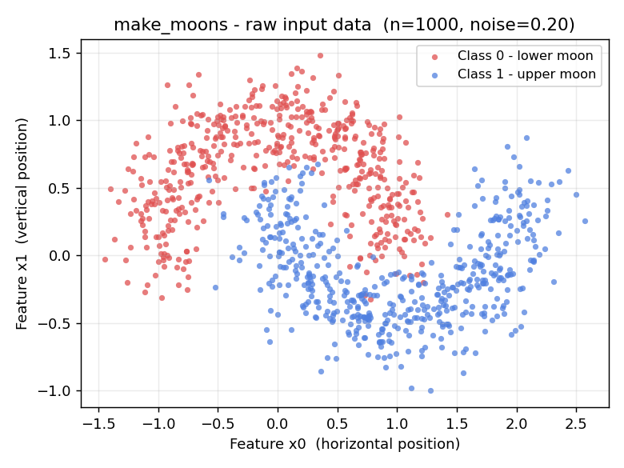

> [!NOTE]
> An epoch is **not** the same as a gradient update step. A **gradient update step** (also called an iteration or a step) happens once per mini-batch  -  the weights are adjusted after seeing just `batch_size` samples. An epoch contains many gradient steps. If your dataset has 1,000 samples and you use a batch size of 64, each epoch contains approximately `ceil(1000 / 64) = 16` gradient update steps. This distinction matters when comparing training speed between runs with different batch sizes  -  a run with batch size 16 performs 4x more weight updates per epoch than one with batch size 64, even if both process the same data.

> [!TIP]
> The best mental model for an epoch is a student studying a textbook. The first time through (epoch 1), they absorb the broad outlines but miss many details. The second time, they understand more connections. By the tenth pass, they have internalized the material deeply  -  but if they keep re-reading, they might start memorising specific sentence phrasings rather than the underlying ideas. Training epochs work exactly the same way.

---

## What Actually Happens Inside One Epoch

Understanding an epoch at the surface level ("it loops over the data") is not the same as understanding what physically happens to the model during that loop. This section walks through every mechanical step in sequence  -  from raw input numbers to the concrete weight changes that accumulate into learned behaviour.

### Step-by-Step Walkthrough of a Single Epoch

The diagram below shows every operation that executes inside one complete epoch, broken into its three stages: data preparation, the training pass (runs once per mini-batch), and the validation pass (runs once at the end of the epoch with no weight changes).

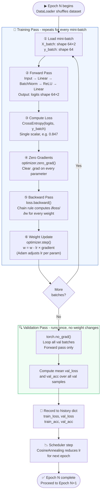

> [!NOTE]
> The six steps inside the training loop are explained in depth in the subsections below. Each subsection corresponds to one numbered box in the diagram above.

---

### Step ①  -  Load Mini-Batch

The **DataLoader** slices the shuffled training set into fixed-size chunks called **mini-batches**. Each mini-batch is two tensors handed together to the model: `X_batch` containing the input features and `y_batch` containing the true class labels.

The image below shows the same scatter plot with two individual points highlighted - one from each class - to illustrate exactly what a single row in `X_batch` looks like and what its `y_batch` label represents.

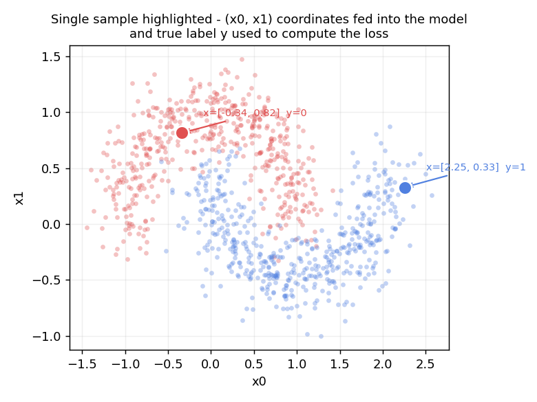

> [!NOTE]
> **What is a true label - and is it the predicted answer?**
>
> No - a true label is the **correct answer that already exists in the dataset before the model sees it**. It is not a prediction. It is the ground truth.
>
> In this project the dataset is generated by `make_moons` from scikit-learn. Every data point is a 2-D coordinate `[x, y]` that was placed on either the upper moon curve (label = 1) or the lower moon curve (label = 0). The generator knows which moon it placed each point on, so the label is recorded at creation time. The model never sees these labels during inference - it only sees the `[x, y]` coordinates and must guess. During training the true labels are revealed after the guess so the model can measure how wrong it was.
>
> The true label is also called the **target**, **ground truth**, or **annotation** depending on context. In image recognition, a human annotator writes "cat" or "dog" next to each photo - that is the true label. In medical diagnosis, a doctor confirms whether a tumour is malignant - that is the true label.
>
> **What if you do not know the correct answers?** That is a different kind of problem called **unsupervised learning**. There are no labels at all - the model must discover structure in the data on its own (e.g. clustering similar points together). You cannot compute accuracy in unsupervised learning because there is no known correct answer to compare against. This project uses **supervised learning** - every training point has a known correct label, which is what makes the loss function and accuracy calculation possible.
>
> **How accuracy is calculated from labels:**
> ```
> model prediction for row 0:  logits = [-1.2,  3.4]  -> predicted class = 1  (highest logit)
> true label for row 0:        y = 1
> correct?  yes  -> count as 1
>
> model prediction for row 3:  logits = [ 1.8,  0.1]  -> predicted class = 0
> true label for row 3:        y = 1
> correct?  no   -> count as 0
>
> accuracy = (number of correct predictions) / (total samples)
>          = 58 correct out of 64 samples
>          = 58 / 64 = 90.6% for this mini-batch
> ```
> Accuracy is only meaningful because `y_batch` exists. Without it there is nothing to compare the model's guesses against.

**What a mini-batch physically looks like (batch size = 4, shown for clarity):**

```
X_batch  shape: (4, 2)          y_batch  shape: (4,)
┌─────────────────────┐         ┌─────┐
│  row 0:  [ 0.82, -0.31] │         │  1  │  <- upper moon  (true label, not a prediction)
│  row 1:  [-0.44,  0.77] │         │  0  │  <- lower moon
│  row 2:  [ 1.13,  0.05] │         │  1  │  <- upper moon
│  row 3:  [-0.91, -0.48] │         │  0  │  <- lower moon
└─────────────────────┘         └─────┘
  each row = one data point         each value = correct answer known at dataset creation
  col 0 = x coordinate              0 = lower moon
  col 1 = y coordinate              1 = upper moon
```

In production this project uses **batch size = 64**, so `X_batch` is shape `(64, 2)` - a grid of 64 rows and 2 columns. Every row is one point from the two-moons scatter plot. The full training set has 800 points, so each epoch contains `ceil(800 / 64) = 13` mini-batches.

**Why not feed all 800 points at once?**

| # | Approach | Memory | Updates per Epoch | Gradient Quality |
|---|---|---|---|---|
| <sub>1</sub> | <sub>Full batch (800)</sub> | <sub>High</sub> | <sub>1</sub> | <sub>Exact - uses all data</sub> |
| <sub>2</sub> | <sub>Mini-batch (64) - used here</sub> | <sub>Low</sub> | <sub>13</sub> | <sub>Good estimate - fast learning</sub> |
| <sub>3</sub> | <sub>Single sample (1)</sub> | <sub>Minimal</sub> | <sub>800</sub> | <sub>Very noisy - unstable</sub> |

> [!NOTE]
> **Plain English:** A mini-batch is like grading a random sample of 64 homework papers rather than all 800 at once. You get a pretty good estimate of how the whole class is doing, you can give feedback quickly, and you do it 13 times per epoch instead of just once. That means 13 weight updates per epoch instead of 1 - the model learns much faster.

---

### Step ②  -  Forward Pass

When you call `model(X_batch)`, PyTorch executes the following sequence of tensor operations through the network layers. The input is two raw numbers for each sample (the x-coordinate and y-coordinate of a moon point). The output is two numbers called **logits**  -  one raw score for each class. The class with the higher logit is the model's prediction.

> [!NOTE]
> **What is a logit?** The word comes from *log-odds* - the logarithm of the ratio of the probability of an event to the probability of its complement: $\log\frac{p}{1-p}$. In a neural network the term is used more loosely to mean any raw, unbounded output score produced by the final linear layer **before** any normalising function (sigmoid or softmax) is applied. A logit has no fixed range - it can be any real number, positive or negative. A large positive logit means the model has strong evidence for that class; a large negative logit means strong evidence against it; a logit near zero means the model is uncertain. The logit is converted to a probability between 0 and 1 by applying softmax: $P(\text{class}_k) = \frac{e^{z_k}}{\sum_j e^{z_j}}$ where $z_k$ is the logit for class $k$. PyTorch's `CrossEntropyLoss` does this conversion internally, so you always pass raw logits to the loss function - never pre-softmaxed values.

For the `medium` MLP with input `[x, y]`, the computation is:

```
Input:      [x, y]                         shape: (64, 2)
  ↓  Linear(2 → 64):  out = X @ W1.T + b1  shape: (64, 64)
  ↓  BatchNorm1d(64):  normalise each feature across the batch
  ↓  ReLU:             max(0, out)          shape: (64, 64)   -  negatives become 0
  ↓  Dropout(p=0.1):   randomly zero 10% of activations during training
  ↓  Linear(64 → 64):  out = X @ W2.T + b2 shape: (64, 64)
  ↓  BatchNorm1d(64):  normalise again
  ↓  ReLU:             max(0, out)
  ↓  Linear(64 → 2):   out = X @ W3.T + b3 shape: (64, 2)
Output:     [logit_class0, logit_class1]    shape: (64, 2)
```

> [!NOTE]
> **What do those layer names actually mean?**
> - **Linear(2 → 64):** A fully-connected layer - every input number is multiplied by a learned weight and added to every output number. Think of it as 64 different weighted combinations of the two input coordinates.
> - **BatchNorm1d:** After each linear layer, the numbers can become very large or very small, which slows learning. BatchNorm re-centres and rescales them to a predictable range - like adjusting the volume back to a comfortable level after each song.
> - **ReLU:** A simple on/off gate. If a neuron's output is positive, it passes through unchanged. If it's negative, it becomes zero. This one-line operation is what allows the network to learn curved shapes instead of just straight lines.
> - **Dropout(p=0.1):** During training, 10% of neuron outputs are randomly zeroed out on each pass. This forces the network to not rely too heavily on any single neuron - similar to studying in rotating groups so you never depend entirely on one person's notes. It reduces overfitting.

> [!NOTE]
> At this stage the output numbers are **not** probabilities. They are raw, unconstrained scores  -  a logit of `3.4` for class 1 and `-1.2` for class 0 just means "the model strongly believes this point is class 1." To convert logits to probabilities between 0 and 1 that sum to 1, you apply **softmax**: `P(class_k) = exp(logit_k) / sum(exp(logits))`. `CrossEntropyLoss` applies this conversion internally, which is why you pass raw logits to the loss function rather than softmax outputs.

**Shape flow through every layer for one mini-batch of 64 points:**

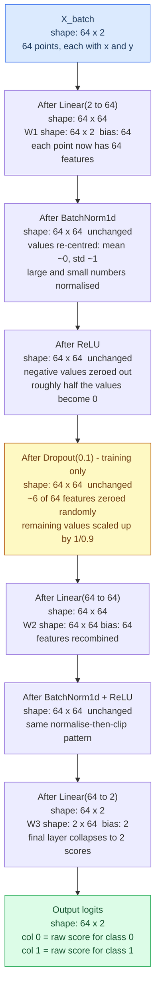

**What the values look like at each stage for a single sample `[0.82, -0.31]`:**

```
Input            [ 0.82, -0.31 ]                     shape: (2,)

After Linear1    [ 1.24,  0.03, -0.87,  0.55, ... ]  shape: (64,)
                   ^large  ^near0 ^neg    ^pos
                   raw mix of x and y via learned weights

After BatchNorm  [ 1.41,  0.02, -0.99,  0.63, ... ]  shape: (64,)
                   values shifted so the batch has mean~0, std~1
                   individual values change slightly, pattern preserved

After ReLU       [ 1.41,  0.02,  0.00,  0.63, ... ]  shape: (64,)
                   negative -0.99 becomes 0.00
                   positive values pass through unchanged

After Linear2+BN+ReLU  [ 0.94, 0.00, 1.22, 0.00, ... ]  shape: (64,)
                         second layer recombines features

Output logits    [ -1.2,  3.4 ]                      shape: (2,)
                    ^class0    ^class1
                    model predicts class 1 (higher score wins)
```

---

### Step ③  -  Compute Loss

After the forward pass produces a `(64, 2)` logits tensor, `CrossEntropyLoss` compares those predictions against the true labels `y_batch` of shape `(64,)` and produces **a single scalar number** - the loss.

**What the single scalar actually represents:**

> The loss is the **average wrongness** of the model across all 64 samples in the mini-batch. A loss of `0.847` means: on average, for each sample, the model placed about `e^{-0.847} ≈ 43%` probability on the correct class. A perfect model (100% on correct class every time) would have loss = 0. A random guesser on a 2-class problem has loss ≈ `ln(2) ≈ 0.693`.

**How CrossEntropyLoss turns 64 rows into one number - step by step:**

```
Step 1 - Logits for 4 samples (showing 4 of 64 for clarity):
         class0   class1   true_label
row 0: [ -1.20,   3.40 ]     1        <- predicts class 1 correctly
row 1: [  2.10,  -0.50 ]     0        <- predicts class 0 correctly
row 2: [  0.30,   0.28 ]     1        <- uncertain, small gap
row 3: [  1.80,   0.10 ]     1        <- predicts class 0 WRONGLY

Step 2 - Softmax converts logits to probabilities (sum to 1 per row):
         class0   class1
row 0: [  0.01,   0.99 ]   true=1  prob of correct = 0.99
row 1: [  0.93,   0.07 ]   true=0  prob of correct = 0.93
row 2: [  0.50,   0.50 ]   true=1  prob of correct = 0.50
row 3: [  0.83,   0.17 ]   true=1  prob of correct = 0.17  <- model was wrong

Step 3 - Cross-entropy: take -log of the correct class probability:
row 0:  -log(0.99) =  0.01   (confident and right = tiny penalty)
row 1:  -log(0.93) =  0.07   (confident and right = tiny penalty)
row 2:  -log(0.50) =  0.69   (uncertain = medium penalty)
row 3:  -log(0.17) =  1.77   (confident and WRONG = large penalty)

Step 4 - Average across all 64 rows:
         loss = mean([0.01, 0.07, 0.69, 1.77, ...]) = 0.847
                                                       ^^^^^
                                               this is the scalar
```

> [!NOTE]
> **Why -log?** The function `-log(p)` has a key property: when `p` is close to 1 (model is confident and correct), `-log(p)` is close to 0 - almost no penalty. When `p` is close to 0 (model is confident and wrong), `-log(p)` shoots toward infinity - a huge penalty. This asymmetry is exactly what you want from a training signal: being confidently wrong hurts far more than being uncertain.

> [!NOTE]
> **What does a loss of 0.847 mean in plain English?** On this mini-batch the model is moderately confused. A loss below 0.1 means the model is highly confident and correct on almost every sample. A loss above 0.5 means the model is either uncertain on most samples or confidently wrong on some. At the very start of training (random weights) loss is typically around `0.693` for a 2-class problem.

---

### Step ④  -  Zero Gradients

Before computing new gradients, every parameter's `.grad` attribute must be reset to zero. This happens via `optimizer.zero_grad()`.

**Why this step is necessary - what `.grad` contains before and after:**

```
Before zero_grad() - .grad still holds values from the PREVIOUS mini-batch:

layers.0.weight.grad  shape: (64, 2)    <- same shape as the weight itself
  [[ +0.034,  -0.012 ],
   [ -0.081,  +0.063 ],
   [ +0.007,  +0.041 ],
   ...64 rows...]                       <- leftover from batch N-1

After zero_grad() - all values wiped to exactly 0.0:

layers.0.weight.grad  shape: (64, 2)
  [[ 0.000,  0.000 ],
   [ 0.000,  0.000 ],
   [ 0.000,  0.000 ],
   ...64 rows of zeros...]              <- clean slate for batch N
```

**What goes wrong if you forget `zero_grad()`:**

```
Batch 1 gradients:   w.grad = [ +0.08, -0.03 ]   (correct for batch 1)
Batch 2 gradients:   w.grad = [ +0.05, +0.01 ]   (what batch 2 SHOULD give)

Without zero_grad(): w.grad = [ +0.13, -0.02 ]   (batch 1 + batch 2 ADDED)
                                ^wrong  ^wrong
Optimiser applies the WRONG update - the model trains incorrectly.
Loss may not converge, or converges to a worse solution.
```

> [!NOTE]
> **Why does PyTorch accumulate instead of overwrite by default?** It is a deliberate design choice for **gradient accumulation** - a technique used when your GPU cannot fit a large batch in memory. You run several small batches, accumulate their gradients without zeroing, then apply one combined update as if you had used a larger batch. For standard training you never want this - so `zero_grad()` must be called explicitly before every batch.

---

### Step ⑤  -  Backward Pass

After the forward pass produces a scalar loss value (e.g. `0.847`), PyTorch knows how that loss was computed  -  it tracked every operation in a **computation graph** built automatically during the forward pass. The backward pass walks this graph in reverse, applying the chain rule of calculus at each step to compute how much each individual weight contributed to the final loss.

The result is a **gradient** for every learnable parameter in the model. A gradient is a number attached to each weight that answers the question: "If I increase this weight by a tiny amount, does the loss go up or down, and by how much?" A positive gradient means increasing the weight increases the loss  -  so the optimiser should decrease it. A negative gradient means increasing the weight decreases the loss  -  so the optimiser should increase it.

For a single weight `w`, the update rule used by gradient descent is:

```
w_new = w_old  -  learning_rate × gradient
```

> [!NOTE]
> **Plain English:** The gradient tells you which direction makes the loss go up. The formula says: step in the opposite direction by a small amount. The **learning rate** controls the step size - too large and you overshoot the good solution, too small and training takes forever.
>
> With plain **SGD** every weight gets exactly the same step size: `new_weight = old_weight - learning_rate * gradient`. It is the simplest possible rule - and it works - but it requires careful hand-tuning of the learning rate.
>
> **Adam** (Adaptive Moment Estimation) automatically tunes the step size per weight: weights that have been changing a lot recently get a smaller nudge; weights that have barely moved get a larger one. In practice this means Adam almost always converges faster than SGD with less manual tuning.
>
> **AdamW** is Adam with one important fix: it applies weight decay correctly. Weight decay is a gentle penalty that pulls every weight slowly back toward zero each step, which prevents weights from growing too large and overfitting. Adam applies this penalty through the gradient calculation, which accidentally weakens the decay for the most-updated weights. AdamW applies the shrinkage separately so every weight is penalised equally. For large models (transformers, etc.) this makes a significant accuracy difference.

With Adam, the learning rate is adjusted individually for each weight based on the history of its past gradients, which makes the optimiser converge faster and handle parameters with very different gradient magnitudes more gracefully than plain SGD.

**What the gradient matrices look like after `loss.backward()` - every parameter gets a `.grad` of the same shape:**

```
layers.0.weight        shape: (64, 2)     64 neurons, 2 inputs each
layers.0.weight.grad   shape: (64, 2)     one gradient per weight

  weight value:         gradient after backward:
  [[ 0.45, -0.22 ],     [[ +0.034, -0.019 ],
   [-0.81,  0.63 ],      [ -0.081, +0.063 ],
   [ 0.12,  0.39 ],      [ +0.002, +0.007 ],
   ...                   ...              ]

Reading the gradient:
  +0.034 on weight[0,0]:  increasing this weight raises the loss -> decrease it
  -0.081 on weight[1,0]:  increasing this weight lowers the loss -> increase it
  +0.002 on weight[2,0]:  very small gradient -> this weight barely affects loss

output.weight          shape: (2, 64)     2 classes, 64 incoming features
output.weight.grad     shape: (2, 64)     one gradient per weight

  row 0 gradients (class 0 detector):  [ +0.12, -0.05, +0.03, ... ]  64 values
  row 1 gradients (class 1 detector):  [ -0.12, +0.05, -0.03, ... ]  64 values
  note: output layer gradients are typically mirror-opposite for 2-class problems
```

> [!NOTE]
> **Plain English - what backward pass actually does:** Imagine each weight is a dial. The gradient for that dial answers: "if I turn this dial up by a tiny amount, does the model's total wrongness (loss) go up or down?" The backward pass computes that answer for every single dial simultaneously - all ~4,700 of them - in one efficient pass through the network in reverse. No weights change yet. Only the answer is written down. `optimizer.step()` (Step ⑥) is what actually turns the dials.

> [!IMPORTANT]
> The backward pass does **not** change any weights. It only computes and stores gradients in the `.grad` attribute of each parameter tensor. The actual weight change happens in the next step: `optimizer.step()`. This two-step design  -  compute gradients, then apply them  -  is what allows advanced techniques like gradient clipping (capping gradient magnitudes before they are applied) and gradient accumulation (summing gradients over multiple batches before applying a single large update).

---

### Step ⑥  -  Weight Update

Once every parameter has a `.grad` value from the backward pass, `optimizer.step()` applies the actual update. Three common optimisers take very different approaches:

> [!NOTE]
> **SGD vs Adam vs AdamW - which optimiser does what?**
>
> | Optimiser | Core idea | Strength | Weakness |
> |---|---|---|---|
> | **SGD** (plain) | `w = w - lr * grad` - every weight gets the same fixed step size | Simple, well-understood, often generalises well in vision tasks | Needs careful manual tuning of the learning rate; slow on parameters with very different gradient scales |
> | **Adam** | Tracks a running average of past gradients (momentum) AND a running average of squared gradients (scaling) - each weight gets its own adaptive step size | Fast convergence, tolerant of different gradient scales, less manual tuning needed | Weight decay is applied **incorrectly** (see below) |
> | **AdamW** | Adam with the weight-decay fix - decouples the regularisation penalty from the gradient update | Same speed as Adam but with correct regularisation - the current best-practice default in most frameworks | Slightly more hyperparameters (lr + weight decay + beta1 + beta2) |
>
> **Why does Adam have a weight-decay problem?**
>
> *What weight decay is:* Weight decay is a regularisation technique that slowly shrinks every weight toward zero each step, regardless of the gradient. Think of it as a mild gravitational pull back to zero. Small weights produce smoother, simpler decision boundaries, which generally generalise better. Without it, weights can grow large and the model becomes overly confident on training data but brittle on new data (overfitting).
>
> *The maths problem:* The standard way to add weight decay is to add a penalty term `lambda * w` to the gradient, so the update becomes `w = w - lr * (grad + lambda * w)`. With plain SGD, that is equivalent to multiplying `w` by `(1 - lr * lambda)` each step - a clean shrinkage. With Adam, however, the combined term `(grad + lambda * w)` is then scaled by Adam's adaptive denominator. This means weights that have been changing a lot (large denominator) receive weaker decay than weights that have barely changed. The regularisation effect is inconsistent and much weaker than intended - especially for commonly-updated parameters.
>
> *What AdamW does:* AdamW applies the weight-decay shrinkage **after** the adaptive gradient update instead of mixing it in before:
> `w = w - lr * adam_update(grad) - lr * lambda * w`
> Now every weight is shrunk by exactly the same proportion `(lr * lambda)` regardless of its gradient history. The penalty is decoupled.
>
> *In this project:* `torch.optim.Adam` is used with `weight_decay=1e-4`. For a small two-class problem like `make_moons` the difference between Adam and AdamW is negligible, but in large language models or vision transformers the distinction is critical.

For plain gradient descent the rule is `w_new = w_old - lr * grad`. Adam adds two refinements: it tracks a running average of past gradients (momentum) and a running average of squared gradients (scaling), producing an **adaptive effective step size** per weight.

> [!NOTE]
> **What is a parameter and what is a `.grad` value?**
>
> A **parameter** is one of the ~4,700 individual floating-point numbers the model learns. Every `nn.Linear` layer contains a weight matrix and a bias vector - each number inside those is a parameter. You can think of each parameter as a single dial on a very large control panel.
>
> A **`.grad` value** is the answer to: "if I increase this one dial by a tiny amount, does the total loss go up or down, and by how much?" It is computed by the backward pass and stored right next to the parameter itself.
>
> ```
> Parameter name            What it is                  Example value   Example .grad
> ─────────────────────────────────────────────────────────────────────────────────
> layers.0.weight[0, 0]    first neuron's x-weight        +0.4500         +0.034
>                          "how much does input x         ^the dial       ^turning it up
>                           activate neuron 0?"            value           raises loss
>
> layers.0.weight[0, 1]    first neuron's y-weight        -0.2200         -0.019
>                          "how much does input y         ^negative       ^turning it up
>                           activate neuron 0?"            weight          lowers loss
>
> layers.0.bias[0]         neuron 0's activation          +0.0800         +0.005
>                          threshold offset               ^small bias     ^mild upward pull
>
> output.weight[1, 0]      class-1 logit's weight on      +0.3100         -0.120
>                          first hidden feature           ^positive       ^strong downward pull
>                          "how much does feature 0        weight          -> increase this weight
>                           vote for class 1?"
>
> output.bias[1]           class-1 logit's baseline       +0.2300         -0.120
>                          offset regardless of input     ^raises class1  ^turning it up
>                                                          confidence      lowers loss -> step UP
> ```

**Before and after `optimizer.step()`  -  first layer (input side) and last layer (output side):**

```
── FIRST LAYER  -  layers.0.weight  shape: (64, 2) ──────────────────────────────
  These weights determine how the raw x and y coordinates are mixed
  to activate each of the 64 first-layer neurons.

  Parameter              Before step()  Gradient  After step()  Changed by
  ─────────────────────────────────────────────────────────────────────────
  layers.0.weight[0, 0]   +0.4500       +0.034     +0.4491       -0.0009
  layers.0.weight[0, 1]   -0.2200       -0.019     -0.2198       +0.0002
  layers.0.weight[1, 0]   -0.8100       -0.081     -0.8089       +0.0011
  layers.0.weight[1, 1]   +0.6300       +0.063     +0.6291       -0.0009
  layers.0.weight[2, 0]   +0.1200       +0.002     +0.1199       -0.0001
  layers.0.weight[2, 1]   +0.3900       +0.007     +0.3899       -0.0001
  layers.0.bias[0]         +0.0800       +0.005     +0.0799       -0.0001
  layers.0.bias[1]         -0.0300       -0.011     -0.2989       +0.0001
    ... 56 more neurons ...

  Reading row 0 together: neuron 0 currently detects a direction that is
  mostly +x (-0.22y). Gradient says both weights pull loss upward slightly,
  so both are nudged down - neuron 0 will respond slightly less to x next batch.

── LAST LAYER  -  output.weight  shape: (2, 64)  and  output.bias  shape: (2,) ──
  These weights are the final voting layer. Row 0 = evidence for class 0
  (lower moon). Row 1 = evidence for class 1 (upper moon).

  Parameter              Before step()  Gradient  After step()  Changed by
  ─────────────────────────────────────────────────────────────────────────
  output.weight[0,  0]   +0.5100       +0.120     +0.5087       -0.0013
  output.weight[0,  1]   -0.3400       -0.050     -0.3394       +0.0006
  output.weight[0, 63]   +0.1700       +0.030     +0.1697       -0.0003
  output.weight[1,  0]   -0.5100       -0.120     -0.5087       +0.0013
  output.weight[1,  1]   +0.3400       +0.050     +0.3394       -0.0006
  output.weight[1, 63]   -0.1700       -0.030     -0.1697       +0.0003
  output.bias[0]          -0.1800       +0.110     -0.1812       -0.0012
  output.bias[1]          +0.2300       -0.120     +0.2313       +0.0013

  Note: output.weight rows are mirror-opposite (what helps class 1 hurts class 0).
  output.bias[1] has gradient -0.120 - the largest single gradient here -
  meaning the class-1 baseline logit is being actively pushed upward this batch.
  The model is learning that class 1 needs a stronger baseline confidence.
```

> The effective step size (~0.001) is much smaller than the raw gradient. Adam divides the gradient by a stability factor derived from its history, so a gradient of `0.034` becomes a weight change of only `0.0009`. This prevents large, destabilising jumps.
>
> With plain **SGD**, that same gradient would produce a step of exactly `lr * 0.034 = 0.01 * 0.034 = 0.00034` - a fixed fraction regardless of history. With **AdamW** the gradient update arithmetic is identical to Adam, but the `weight_decay=1e-4` shrinkage is then applied as a clean, separate multiplication (`w *= 1 - lr * 1e-4`) rather than being folded into the gradient estimate.

**What accumulates across an entire epoch (13 mini-batches):**

```
Epoch start:  layers.0.weight[0,0] = +0.4500

After batch 1:   +0.4491   (nudged down - gradient was positive)
After batch 2:   +0.4483   (nudged down again)
After batch 3:   +0.4481   (small nudge - gradient was small)
After batch 4:   +0.4476
After batch 5:   +0.4469
...13 batches...
Epoch end:    layers.0.weight[0,0] = +0.4421   (total move: -0.0079 this epoch)
```

> [!NOTE]
> **Plain English - why so many tiny steps?** One large step would likely overshoot the best weight value - like trying to land a plane by cutting the engine at altitude instead of gradually descending. Many small steps let the optimiser feel its way toward the minimum of the loss surface, correcting course after each batch. The learning rate decay (cosine annealing) makes the steps progressively smaller as training progresses, so early epochs move fast and later epochs fine-tune precisely.

---

### What the Model Is Actually Learning

The model is learning the **weights**  -  the numerical values inside the `nn.Linear` layers. These are floating-point numbers, nothing more. But the pattern of values across all weights collectively encodes a function that maps any input point `[x, y]` to a class prediction. That encoded function is what we call "what the model has learned."

Concretely, for the two-moons problem, the model is learning a set of weights that implements a smooth curved decision boundary. It does not learn the boundary as an explicit equation like "if x² + y² > r then class 1." Instead, the boundary emerges implicitly from the interplay of all the weight values across all layers. Each layer learns to detect progressively more abstract features:

- **Layer 1 weights** (shape `64×2`)  -  learn to detect linear combinations of x and y, effectively rotating and scaling the 2-D input space into 64 different linear projections. Each of the 64 neurons detects a different linear direction in the input.
- **Layer 2 weights** (shape `64×64`)  -  learn to combine the 64 linear detections from layer 1 into 64 higher-order features, some of which will detect curved or nonlinear combinations that neither layer alone could produce.
- **Layer 3 weights** (shape `2×64`)  -  learn a linear combination of all 64 abstract features that best separates the two classes. This is the final decision layer.

> [!TIP]
> Think of it this way: the input `[x, y]` is a point on a map. Layer 1 stretches and rotates that map in 64 different ways simultaneously. Layer 2 takes those 64 distorted maps and combines them in 64 new ways, creating curved shapes. Layer 3 draws a single straight line on this final distorted map  -  but because the distortion is non-linear, the "straight line" in the distorted space maps back to a smooth curve in the original `[x, y]` space. That curve is the decision boundary.

---

### How the Model's Knowledge Is Stored

Everything the model has learned after any number of epochs is stored in a single Python dictionary called the **state dict**. This dictionary maps the name of every learnable parameter to its current numerical tensor. When you save a checkpoint with `torch.save(model.state_dict(), path)`, you are writing this dictionary to disk in PyTorch's binary format.

#### State Dict Structure

For the `medium` MLP, calling `model.state_dict()` returns a dictionary with the following keys and shapes:

**Table A - Parameter Identity**

| # | Key | Tensor Shape | Total Values | What It Stores |
|---|---|---|---|---|
| <sub>1</sub> | <sub>`layers.0.weight`</sub> | <sub>`(64, 2)`</sub> | <sub>128</sub> | <sub>Weight matrix for Linear(2→64) - maps raw x,y input to 64 features</sub> |
| <sub>2</sub> | <sub>`layers.0.bias`</sub> | <sub>`(64,)`</sub> | <sub>64</sub> | <sub>Bias vector for the first linear layer</sub> |
| <sub>3</sub> | <sub>`layers.1.weight`</sub> | <sub>`(64,)`</sub> | <sub>64</sub> | <sub>Learnable scale (gamma) for BatchNorm - applied after normalisation</sub> |
| <sub>4</sub> | <sub>`layers.1.bias`</sub> | <sub>`(64,)`</sub> | <sub>64</sub> | <sub>Learnable shift (beta) for BatchNorm - shifts each feature's mean</sub> |
| <sub>5</sub> | <sub>`layers.1.running_mean`</sub> | <sub>`(64,)`</sub> | <sub>64</sub> | <sub>Non-learnable running average of feature means across all batches seen</sub> |
| <sub>6</sub> | <sub>`layers.1.running_var`</sub> | <sub>`(64,)`</sub> | <sub>64</sub> | <sub>Non-learnable running variance of features across all batches seen</sub> |
| <sub>7</sub> | <sub>`layers.3.weight`</sub> | <sub>`(64, 64)`</sub> | <sub>4,096</sub> | <sub>Weight matrix for Linear(64→64) - combines first-layer features</sub> |
| <sub>8</sub> | <sub>`layers.3.bias`</sub> | <sub>`(64,)`</sub> | <sub>64</sub> | <sub>Bias vector for the second linear layer</sub> |
| <sub>9</sub> | <sub>`layers.4.weight`</sub> | <sub>`(64,)`</sub> | <sub>64</sub> | <sub>BatchNorm scale for second hidden layer</sub> |
| <sub>10</sub> | <sub>`layers.4.bias`</sub> | <sub>`(64,)`</sub> | <sub>64</sub> | <sub>BatchNorm shift for second hidden layer</sub> |
| <sub>11</sub> | <sub>`layers.4.running_mean`</sub> | <sub>`(64,)`</sub> | <sub>64</sub> | <sub>Running mean for second BatchNorm</sub> |
| <sub>12</sub> | <sub>`layers.4.running_var`</sub> | <sub>`(64,)`</sub> | <sub>64</sub> | <sub>Running variance for second BatchNorm</sub> |
| <sub>13</sub> | <sub>`output.weight`</sub> | <sub>`(2, 64)`</sub> | <sub>128</sub> | <sub>Weight matrix for final Linear(64→2) - produces class logits</sub> |
| <sub>14</sub> | <sub>`output.bias`</sub> | <sub>`(2,)`</sub> | <sub>2</sub> | <sub>Two learned scalar offsets, one per class. Initialised to 0. After training each value shifts that class's raw logit up or down independently of the input features. For example `output.bias[1] = +0.4` means every class-1 logit is boosted by 0.4 before softmax, raising the model's baseline confidence for class 1 regardless of what the hidden layers produce. This compensates for class-frequency imbalance and baseline activation magnitude differences between the two output neurons.</sub> |

> [!NOTE]
> Table A shows the identity, shape, and stored content of every key. Table B below shows when each parameter is most actively changing during training.

**Table B - Training Phase Activity**

| # | Key | Training Phase | What Is Happening to This Parameter |
|---|---|---|---|
| <sub>1</sub> | <sub>`layers.0.weight`</sub> | <sub>Underfitting + Learning</sub> | <sub>Largest gradient-driven changes happen here. Neurons rotate and scale their x,y detectors rapidly in the first 20% of training, then fine-tune through the learning phase, and stabilise at convergence.</sub> |
| <sub>2</sub> | <sub>`layers.0.bias`</sub> | <sub>Underfitting + Learning</sub> | <sub>Shifts neuron activation thresholds quickly during underfitting as the model finds the rough input range, then slows during learning and becomes near-static at convergence.</sub> |
| <sub>3</sub> | <sub>`layers.1.weight` (BN gamma)</sub> | <sub>Learning</sub> | <sub>Starts at 1.0 for all features. Diverges from 1.0 during the learning phase as BatchNorm learns which features deserve amplification and which should be suppressed. Stabilises well before overfitting.</sub> |
| <sub>4</sub> | <sub>`layers.1.bias` (BN beta)</sub> | <sub>Learning</sub> | <sub>Starts at 0.0. Shifts per-feature means during the learning phase to compensate for asymmetric activation patterns. Reaches near-final values before convergence.</sub> |
| <sub>5</sub> | <sub>`layers.1.running_mean`</sub> | <sub>All phases (non-learnable)</sub> | <sub>Updated by an exponential moving average on every forward batch through all phases. Stabilises at convergence when the distribution of activations stops changing. Not updated during overfitting if the model is evaluated in eval mode.</sub> |
| <sub>6</sub> | <sub>`layers.1.running_var`</sub> | <sub>All phases (non-learnable)</sub> | <sub>Same update rule as running_mean. Converges to the true variance of each feature once weights stop changing. A still-decreasing running_var indicates the model is still in the learning phase.</sub> |
| <sub>7</sub> | <sub>`layers.3.weight`</sub> | <sub>Learning + Convergence</sub> | <sub>The largest parameter block (4,096 values). Changes steadily through the learning phase as hidden-to-hidden combinations are refined. In the overfitting phase these weights may start over-specialising to individual training points, producing kinks in the decision boundary.</sub> |
| <sub>8</sub> | <sub>`layers.3.bias`</sub> | <sub>Learning + Convergence</sub> | <sub>Shifts individual second-layer neuron thresholds. Settles during convergence. Small but non-zero values here indicate that certain feature combinations need an activation offset to fire correctly.</sub> |
| <sub>9</sub> | <sub>`layers.4.weight` (BN gamma)</sub> | <sub>Learning</sub> | <sub>Same role as layers.1.weight but for the second hidden layer. Learns feature importance scaling one layer deeper into the network.</sub> |
| <sub>10</sub> | <sub>`layers.4.bias` (BN beta)</sub> | <sub>Learning</sub> | <sub>Same role as layers.1.bias for the second BatchNorm. Typically stabilises slightly later than the first layer's BN parameters.</sub> |
| <sub>11</sub> | <sub>`layers.4.running_mean`</sub> | <sub>All phases (non-learnable)</sub> | <sub>Tracks the running mean of second-layer activations. Because second-layer activations depend on first-layer weights that are still changing, this value stabilises later than layers.1.running_mean.</sub> |
| <sub>12</sub> | <sub>`layers.4.running_var`</sub> | <sub>All phases (non-learnable)</sub> | <sub>Running variance of second-layer activations. Last of the running statistics to converge, as it reflects the compounded effect of all upstream weight changes.</sub> |
| <sub>13</sub> | <sub>`output.weight`</sub> | <sub>Learning + Convergence</sub> | <sub>The two rows of this matrix define the final class-voting hyperplane in the 64-dimensional feature space. Row 0 accumulates evidence for class 0; row 1 for class 1. Active learning occurs here throughout the learning phase. During overfitting these weights over-commit to training-specific feature combinations.</sub> |
| <sub>14</sub> | <sub>`output.bias`</sub> | <sub>Learning + Convergence</sub> | <sub>Calibrates the baseline logit for each class independently of the input. Moves quickly during underfitting to compensate for random weight initialisation, settles at a stable offset during convergence. A large asymmetry between the two values after training (e.g. `[-0.5, +0.5]`) signals that the model learned to compensate for a class imbalance or a systematic activation bias in the preceding layer.</sub> |

> [!NOTE]
> "Training Phase" in Table B describes the epoch range where each parameter undergoes its most significant changes - it does not mean the parameter is frozen outside that range. All learnable parameters receive gradient updates on every batch throughout the entire training run; only the magnitude of those updates changes as the learning rate decays and gradients shrink.

> [!NOTE]
> The `medium` model has approximately **4,700 total learnable parameters**  -  the sum of all the `weight` and `bias` tensors listed above (excluding `running_mean` and `running_var`, which are tracked statistics, not learnable parameters, and do not receive gradients). After training, every one of those 4,700 floating-point numbers has been tuned by thousands of tiny gradient-descent steps across 200 epochs of 16 mini-batches each  -  a total of approximately 3,200 individual weight updates.

#### What the Numbers Actually Look Like

You can inspect the learned weights at any time in Python. After training, the values are no longer random  -  they have been shaped by the data into a specific configuration that encodes the moon boundary:

```python
import torch
from src.model import build_model

# Load trained weights from a checkpoint
model = build_model("medium")
ckpt = torch.load("checkpoints/epoch_0200.pt", map_location="cpu")
model.load_state_dict(ckpt["model_state_dict"])

# Inspect the first layer's weight matrix  -  shape (64, 2)
w1 = model.state_dict()["layers.0.weight"]
print(w1.shape)         # torch.Size([64, 2])
print(w1[:3])           # First 3 rows: each row is one neuron's detector direction
# e.g. tensor([[ 0.843, -0.312],   <- this neuron detects a roughly 70-degree direction
#              [-0.521,  0.917],   <- this neuron detects a roughly 120-degree direction
#              [ 0.103,  0.769]])  <- this neuron responds most to high y values

# The output layer weights  -  shape (2, 64)
w_out = model.state_dict()["output.weight"]
print(w_out.shape)      # torch.Size([2, 64])
# Each row is the combination of all 64 features that votes for one class
```

> [!TIP]
> The individual numbers in a trained weight matrix are not human-interpretable on their own  -  you cannot look at a single weight value and say "this represents the upper crescent." The knowledge is **distributed** across all weights simultaneously. The boundary emerges from the interaction of all ~4,700 values together, not from any single number. This is fundamentally different from rule-based systems where you can point to an explicit "if y > 0.5 then class 1" condition.

#### The Checkpoint File Format on Disk

When `utils.save_checkpoint` writes a `.pt` file, it uses `torch.save` which serialises the dictionary to a binary format based on Python's `pickle` protocol, with tensor data stored in a compact binary array format. A checkpoint file for the `medium` model at a single epoch is approximately **20-30 KB** on disk.

| # | What Is Saved | Format | Why |
|---|---|---|---|
| 1 | `model_state_dict` | Python `OrderedDict` of named tensors | The complete learned weights at this epoch |
| 2 | `epoch` | Python `int` | Records which epoch this snapshot represents |
| 3 | `train_loss` | Python `float` | Training loss at this epoch  -  for quick reference without reloading history |
| 4 | `val_loss` | Python `float` | Validation loss at this epoch  -  key metric for selecting the best checkpoint |
| 5 | `train_acc` | Python `float` | Training accuracy at this epoch |
| 6 | `val_acc` | Python `float` | Validation accuracy at this epoch |
| 7 | `capacity` | Python `str` | The preset name  -  needed to reconstruct the correct model architecture before loading weights |

> [!IMPORTANT]
> A checkpoint file stores **only the weights**, not the model architecture. To load a checkpoint you must first construct the model with the correct architecture (matching the number of layers and their sizes), then call `model.load_state_dict(ckpt["model_state_dict"])`. If you try to load weights from a `medium` model into a `large` model, PyTorch will raise a `RuntimeError` because the tensor shapes do not match. This is why the `capacity` key is stored alongside the weights.

#### The History File Format

Alongside checkpoint files, `utils.save_history` writes `outputs/history.json` after each epoch. This is a plain JSON file containing four parallel lists, each of length `num_epochs`, recording every metric at every epoch in human-readable format:

```json
{
  "train_loss": [1.102, 0.891, 0.743, 0.631, 0.541, "..."],
  "val_loss":   [1.098, 0.884, 0.739, 0.627, 0.540, "..."],
  "train_acc":  [0.512, 0.604, 0.681, 0.734, 0.779, "..."],
  "val_acc":    [0.510, 0.600, 0.675, 0.730, 0.772, "..."]
}
```

Each list index corresponds to one epoch (index 0 = epoch 1, index 49 = epoch 50, and so on). This file is loaded by the Jupyter notebook and by all visualisation functions. Because it is plain JSON you can open it in any text editor, inspect the numbers, or load it with Python's built-in `json` module without needing PyTorch installed.

> [!NOTE]
> The `history.json` file records **averages over the entire dataset** for each epoch, not per-batch values. For example, `train_loss[49]` is the mean of all ~16 mini-batch losses that were computed during epoch 50. This averaging smooths out mini-batch noise and gives you one stable number per epoch that represents the overall state of learning at that point in training.

---

### How Learning Accumulates Across Epochs

The five panels below show the model's **decision boundary** at each saved checkpoint. The background colour shows the model's confidence: deep red = confident class 0, deep blue = confident class 1, white dashed line = the 50% decision boundary. Watch how the boundary evolves from a rough split at epoch 1 to a smooth curve that traces the moon shapes by epoch 50.

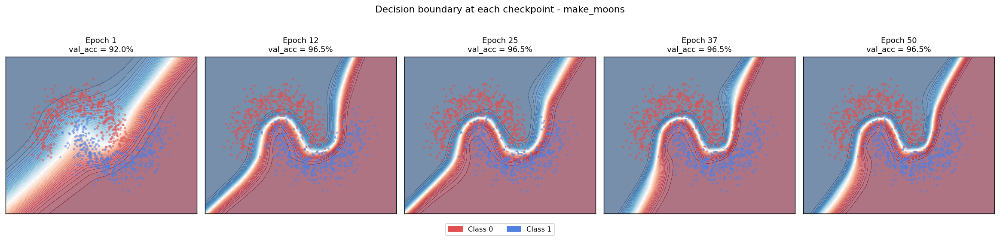

The diagram below shows how the weight values change over the course of a 200-epoch run. At epoch 1 every weight is a small random number near zero. By epoch 200 the weights have been nudged by approximately 3,200 tiny gradient steps (16 batches × 200 epochs) and have settled into a configuration that encodes the moon boundary.

| Epoch Range | What Is Happening to the Weights | Visible Effect on Boundary |
|---|---|---|
| 1 - 10 | Weights move quickly away from random initialisation; large gradients because loss is high | Boundary shifts from random to rough linear separation |
| 10 - 50 | Weights begin to specialise; different neurons start responding to different regions of the input | Boundary starts curving; roughly follows moon shapes |
| 50 - 100 | Weights fine-tune; learning rate is decaying so updates are smaller; BatchNorm statistics stabilise | Boundary tightens; misclassified regions shrink |
| 100 - 150 | Weights nearly converged; very small updates; loss curve is flat | Boundary smooth and stable; changes barely visible between epochs |
| 150 - 200 | Weights essentially static for the medium model; may start overfitting for overfit preset | Boundary barely changes (medium); may start developing kinks (overfit) |

---

#### Checkpoint Matrix  -  Before and After Each Saved Epoch

The five `.pt` files in `checkpoints/` capture the model at evenly-spaced snapshots. The matrix below shows the actual measured metrics from `outputs/history.json` for each saved epoch, what the model looked like just before that snapshot was written, and what changed by the time it was written.

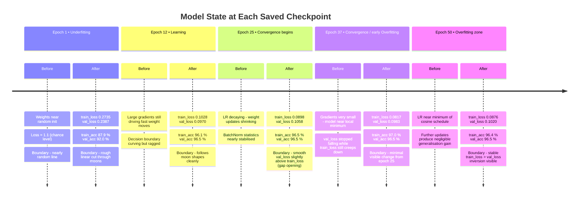

> [!NOTE]
> The timeline above is rendered from `outputs/history.json`. Each "Before" row is the conceptual model state entering that epoch; each "After" row is the recorded state once that epoch completed and the checkpoint was written to disk.

The table below complements the timeline with a side-by-side delta view - showing how much each metric moved between consecutive checkpoints.

**Table  -  Metric Deltas Between Consecutive Checkpoints**

| # | Checkpoint | Train Loss | Val Loss | Train Acc | Val Acc | Phase |
|---|---|---|---|---|---|---|
| <sub>1</sub> | <sub>`epoch_0001.pt`</sub> | <sub>0.2735</sub> | <sub>0.2387</sub> | <sub>87.9 %</sub> | <sub>92.0 %</sub> | <sub>🔴 Underfitting</sub> |
| <sub>2</sub> | <sub>`epoch_0012.pt`</sub> | <sub>0.1028 (-0.1707)</sub> | <sub>0.0970 (-0.1417)</sub> | <sub>96.1 % (+8.2 pp)</sub> | <sub>96.5 % (+4.5 pp)</sub> | <sub>🟠 Learning</sub> |
| <sub>3</sub> | <sub>`epoch_0025.pt`</sub> | <sub>0.0898 (-0.0130)</sub> | <sub>0.1058 (+0.0088)</sub> | <sub>96.5 % (+0.4 pp)</sub> | <sub>96.5 % (±0)</sub> | <sub>🟡 Convergence</sub> |
| <sub>4</sub> | <sub>`epoch_0037.pt`</sub> | <sub>0.0817 (-0.0081)</sub> | <sub>0.0983 (-0.0075)</sub> | <sub>97.0 % (+0.5 pp)</sub> | <sub>96.5 % (±0)</sub> | <sub>🟡 Convergence / early Overfit</sub> |
| <sub>5</sub> | <sub>`epoch_0050.pt`</sub> | <sub>0.0876 (+0.0059)</sub> | <sub>0.1020 (+0.0037)</sub> | <sub>96.4 % (-0.6 pp)</sub> | <sub>96.5 % (±0)</sub> | <sub>🔵 Overfitting zone</sub> |

> [!NOTE]
> The largest single jump in every metric happens between epoch 1 and epoch 12  -  an 11-epoch window where the model recovers from random initialisation and learns the bulk of the moon boundary. By epoch 25 the val_acc has completely plateaued at 96.5 % and stays there for the remainder of training, while train_loss continues to drift slightly downward. This train/val divergence starting at epoch 25 is the earliest signal that the model has entered the convergence zone and further training will not improve generalisation.

> [!TIP]
> You can measure how much the weights are changing per epoch by computing the **L2 norm of the gradient** before each optimiser step: `grad_norm = sum(p.grad.norm()**2 for p in model.parameters())**0.5`. A large gradient norm means the model is still learning fast. A gradient norm near zero means the model has converged. This metric, sometimes called the gradient signal, is a more direct measure of learning progress than the loss value itself.

---

## Why Are Multiple Epochs Needed?

When a neural network is first initialised, its weights are assigned small random values drawn from a carefully calibrated distribution. This means the model's initial predictions are essentially random guesses  -  the **loss** is high, close to the theoretical maximum for the loss function, and there is no meaningful structure in what the network outputs. The first epoch nudges the weights in the right direction for every sample in the dataset, but the individual nudges are small and the model is still far from capturing any real pattern.

Over successive epochs, the model experiences the same data from different random mini-batch orderings (because `shuffle=True` in the DataLoader). This **stochastic shuffling** is important: it introduces controlled variability into the gradient estimates, which prevents the optimiser from following the exact same update path every epoch and prevents the model from memorising the sequence of training examples rather than their content. Each epoch with a new shuffling gives the optimiser a slightly different view of the training set, helping it explore the loss landscape more effectively.

> [!NOTE]
> **Plain English - stochastic shuffling:** Every epoch the training data is dealt out into new random mini-batches, like reshuffling a deck of cards before each round. This means the model never memorises the order in which examples appear - it has to learn patterns that hold no matter what order the data arrives in.

The **cosine annealing learning-rate scheduler** used in this project gradually reduces the learning rate following a cosine curve over the full training run  -  allowing large, exploratory weight updates early in training when the model is far from its optimum, and progressively smaller, fine-grained adjustments later when the model is near convergence and large steps would overshoot the minimum. This automatic decay removes one of the most tedious hyperparameter decisions in deep learning: figuring out when to reduce the learning rate and by how much.

> [!NOTE]
> **Plain English - cosine annealing:** Think of it like landing a plane. Early in training you are flying fast - big learning rate means big weight changes, covering a lot of ground quickly. As you get closer to a good solution (the runway), you gradually slow down so you land smoothly instead of crashing. The cosine curve just gives a natural smooth shape to that deceleration, starting fast, slowing gradually, and nearly stopping at the end.

> [!IMPORTANT]
> Training for **too few** epochs leaves the model in an **underfitted** state. It has not yet discovered the underlying pattern in the data and will perform poorly on both training and validation data because its weights have not been sufficiently adjusted away from their random initialisation. Training for **too many** epochs causes the model to memorise training-set noise rather than the true signal  -  a phenomenon called **overfitting**  -  where training accuracy keeps rising but validation accuracy plateaus or falls because the model has specialised too tightly to the exact training examples it was shown.

The central tension between underfitting and overfitting  -  known as the **bias-variance tradeoff**  -  makes epoch selection one of the most important **hyperparameter** decisions in deep learning. A hyperparameter is any configuration value set before training begins that controls the training process but is not itself learned from data. Epoch count, learning rate, batch size, dropout rate, and model size are all hyperparameters. This project exists to make the bias-variance tension visible, measurable, and tunable through a simple command-line interface.

> [!NOTE]
> **Plain English - bias-variance tradeoff:** Underfitting (high bias) is like a student who skims the textbook and only learns the chapter headings - they miss all the real detail. Overfitting (high variance) is like a student who memorises every sentence word-for-word - they ace questions about the exact book but fail as soon as anything is phrased differently. The goal is the student in the middle: someone who genuinely understood the material.

> [!NOTE]
> **Plain English - hyperparameters vs parameters:** The model's **parameters** (weights and biases) are learned automatically from data during training - you never set them directly. **Hyperparameters** are the settings you choose before training starts, like how long to train, how big to make the model, and how fast to learn. The model cannot learn its own hyperparameters from the data - that is your job as the practitioner.

> [!CAUTION]
> There is no single correct number of epochs that works for all problems. The right epoch count depends on your dataset size, model capacity, learning rate, regularisation strength, and noise level. Always monitor the **validation loss** curve  -  not the training loss  -  to decide when to stop. The validation loss is the only signal that tells you how well the model generalises to unseen data.

---

## The Four Phases of Training

As epochs increase, every model trained with gradient descent passes through four recognisable phases. Understanding which phase you are in  -  by reading the loss and accuracy curves  -  is the core practical skill this project teaches. Each phase has a distinct signature on the metric curves and a distinct appearance on the decision boundary plot.

| # | Phase | Epoch Range | Train Loss | Val Loss | Train Acc | Val Acc | Verdict |
|---|---|---|---|---|---|---|---|
| 1 | Underfitting | First ~10-20% | High, falling fast | High, falling fast | Low | Low | Keep training - model is still learning basics |
| 2 | Learning | 20% - 50% | Falling steadily | Falling steadily | Rising | Rising | Healthy - both splits improving together |
| 3 | Convergence | 50% - 75% | Low and slowing | Low, near-stable | Near peak | Near peak | Optimal - best generalisation lives here |
| 4 | Overfitting | 75%+ | Still falling slightly | Rising | Still rising | Falling | Danger zone - model memorising noise |

> [!WARNING]
> The exact epoch at which each phase begins depends heavily on your model capacity, learning rate, dataset size, and noise level. The percentages above are approximate guidelines for the default settings only. There is no universal boundary. A tiny model may spend the entire training run in the Underfitting phase regardless of epoch count. An over-parameterised model with no regularisation may skip directly to Overfitting after just a handful of epochs.

**Phase 1  -  Underfitting:** During the first phase the model is recovering from random initialisation. Both training and validation loss fall quickly because even small adjustments to randomly initialised weights produce large improvements. The decision boundary at this stage is a crude, nearly straight line that does not follow the moon shapes at all. Accuracy is well below the theoretical ceiling. The right action is always to continue training  -  there is no benefit to stopping here.

**Phase 2  -  Learning:** During the learning phase both loss curves continue falling together and the decision boundary visibly starts to curve and wrap around the moon shapes. The model is genuinely extracting generalisable patterns from the data, and the roughly parallel movement of training and validation curves confirms that the model is not memorising. This is the healthiest phase of training and where you want to spend most of your training budget.

**Phase 3  -  Convergence:** As the learning rate decays and the gradients become smaller, the loss curves flatten out and the decision boundary stops changing significantly from epoch to epoch. This is the optimal stopping region  -  the model has found a good solution and any further training provides diminishing returns. Validation loss is at or near its minimum, which is the true signal that generalisation is at its peak.

**Phase 4  -  Overfitting:** In the final phase the training loss continues to creep down slightly while the validation loss turns upward. On the decision boundary plot, the boundary begins to develop unnecessary kinks and bulges that thread through individual training points rather than following the smooth underlying pattern. The model is memorising noise. Training accuracy approaches 100% while validation accuracy falls  -  the gap between the two is the canonical signature of overfitting.

> [!NOTE]
> **Plain English - the four phases in one sentence each:**
> - **Underfitting:** The model is still basically guessing - keep training.
> - **Learning:** The model is genuinely getting smarter at a healthy pace - this is the productive zone.
> - **Convergence:** The model has figured it out and improvements have nearly stopped - this is your best checkpoint.
> - **Overfitting:** The model stopped learning real patterns and started memorising quirks in the training data - stop here or earlier.

---

## Tech Stack and Architecture

This project is built on a carefully chosen stack that balances simplicity, speed, and educational clarity. Every library was selected because it is the industry standard for its role, has a well-documented API, and requires minimal boilerplate. Understanding why each library is present  -  and what it does  -  gives you a solid foundation for real-world ML projects, where the same tools appear again and again.

### Technology Choices

| # | Layer | Library | Version | Why It Was Chosen | What It Does Here |
|---|---|---|---|---|---|
| 1 | Deep Learning Framework | PyTorch | 2.0+ | Dynamic computation graph, intuitive Python-first API, industry standard for research and increasingly for production | Defines the MLP model, runs forward and backward passes, manages tensors and devices |
| 2 | Dataset Generation | scikit-learn | 1.3+ | `make_moons` produces a non-linear 2-D boundary that makes epoch effects visually obvious; no file I/O required | Generates the training data with a single function call |
| 3 | Numerical Arrays | NumPy | 1.24+ | The universal bridge between scikit-learn arrays and PyTorch tensors; meshgrid for decision boundary plots | Builds the inference grid for boundary plots; handles dtype conversions |
| 4 | Visualisation | Matplotlib | 3.7+ | Full programmatic control over every plot element; PillowWriter for GIF animation export | Draws all loss curves, accuracy curves, decision boundary plots, and the animated GIF |
| 5 | Progress Display | tqdm | 4.65+ | Live per-epoch metrics in the terminal without custom logging boilerplate | Shows epoch number, train/val loss, and accuracy as a progress bar |
| 6 | Interactive Analysis | Jupyter | 1.0+ | Allows post-hoc exploration of saved history and checkpoint comparison without re-running training | Powers `notebooks/epoch_analysis.ipynb` |
| 7 | Package Management | pip + venv | stdlib | Zero-dependency, universally available, reproducible via `requirements.txt` | Creates the isolated environment and installs all packages |

> [!NOTE]
> PyTorch's **dynamic computation graph** (also called eager mode) means the graph is built at runtime as Python code executes, making debugging straightforward  -  you can insert `print()` statements or use a debugger anywhere in the forward pass and inspect intermediate tensor values. Older frameworks like TensorFlow 1.x used static graphs that were compiled before execution, making debugging much harder. PyTorch 2.0 introduced `torch.compile()` for optional static optimisation, but this project uses eager mode for maximum transparency.

> [!NOTE]
> **Plain English - dynamic computation graph:** When your Python code runs `output = model(input)`, PyTorch builds a record of every mathematical operation that happened - which numbers were multiplied, which were added, and in what order. It keeps this record so that during the backward pass it can trace back through every step and calculate how to adjust each weight. Think of it like a receipt that lists every calculation, so the optimiser can work out exactly which calculations need to change to reduce the bill (the loss).

---

## System Architecture Diagrams

### Diagram 1  -  End-to-End Data Pipeline

The project follows a clean pipeline architecture where each module has a single, well-defined responsibility. Data flows in one direction: from raw arrays through training to persisted artifacts, then into visualisation. No module has circular dependencies. The diagram below shows every data artifact and which module produces or consumes it.

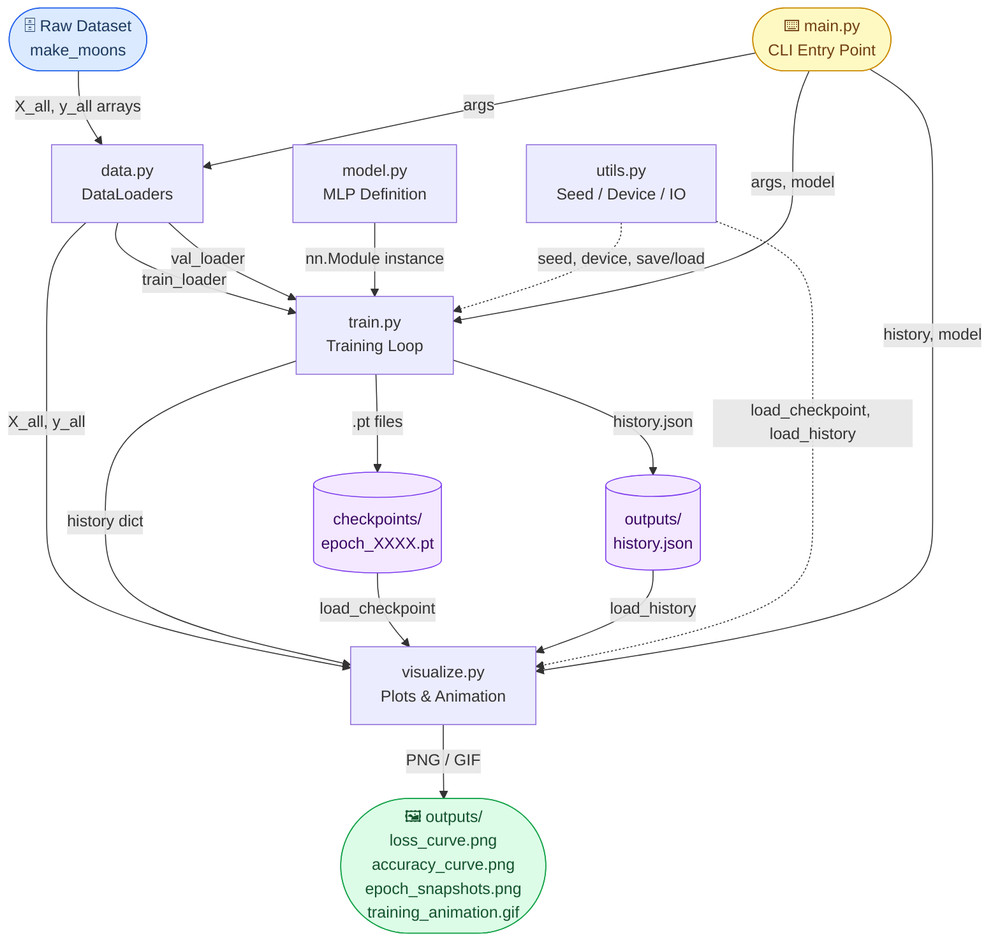

> [!NOTE]
> The dashed arrows from `utils.py` represent helper calls rather than primary data flow. `utils.py` does not own any data  -  it only provides functions that other modules call. This design keeps each module focused on a single responsibility and makes the codebase easy to navigate.

---

### Diagram 2  -  Training Loop Internals (Per Epoch)

The training loop in `train.py` executes the following sequence every epoch. Understanding this cycle at the mechanical level is essential for understanding what "training for more epochs" actually does to a model. Each mini-batch produces one weight update; each epoch produces one entry in the history dictionary.

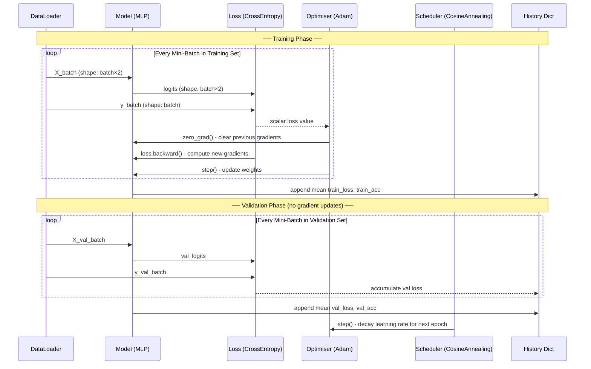

> [!IMPORTANT]
> The call to `optimizer.zero_grad()` at the start of each mini-batch is critical. PyTorch accumulates (adds to) gradients by default rather than overwriting them. If you forget `zero_grad()`, gradients from previous mini-batches contaminate the current update, causing incorrect and unstable training. This is a common source of hard-to-debug training bugs.

---

### Diagram 3  -  Decision Boundary Generation

Producing a decision boundary plot requires running inference on a dense grid of points that tiles the entire feature space. The grid is constructed from the data range, converted to a PyTorch tensor, passed through the trained model, and the resulting probabilities are reshaped into a 2-D array for `matplotlib.contourf`. The coloured surface shows the model's confidence across the feature space.


> [!TIP]
> The 300×300 resolution (90,000 inference points) was chosen to produce smooth-looking contours without excessive computation time. On CPU this inference pass typically takes under 10 ms for the medium model. If you want sharper boundaries at the cost of more computation, you can increase the resolution in `visualize.py`  -  look for the `resolution=300` parameter in `plot_decision_boundary`.

---

### Diagram 4  -  Model Capacity Spectrum

The five model presets span a wide range of expressiveness  -  from a network so small it cannot represent the moon boundary regardless of epoch count, to a network so large it will memorise noise within the first hundred epochs. The capacity preset controls hidden layer widths and dropout rate.

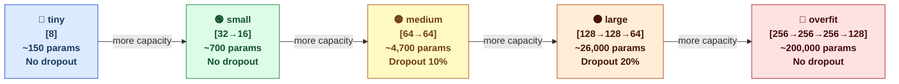

> [!WARNING]
> The `overfit` preset has ~200,000 parameters for a dataset with only 1,000 points and 2 input features. This ratio (200:1) is deliberately extreme. In production, over-parameterisation at this scale on a small dataset will always produce severe overfitting unless strong regularisation is applied. The `overfit` preset deliberately removes Dropout to demonstrate this failure mode clearly.

---

### Diagram 5  -  Idealised Loss Curves Across Epochs

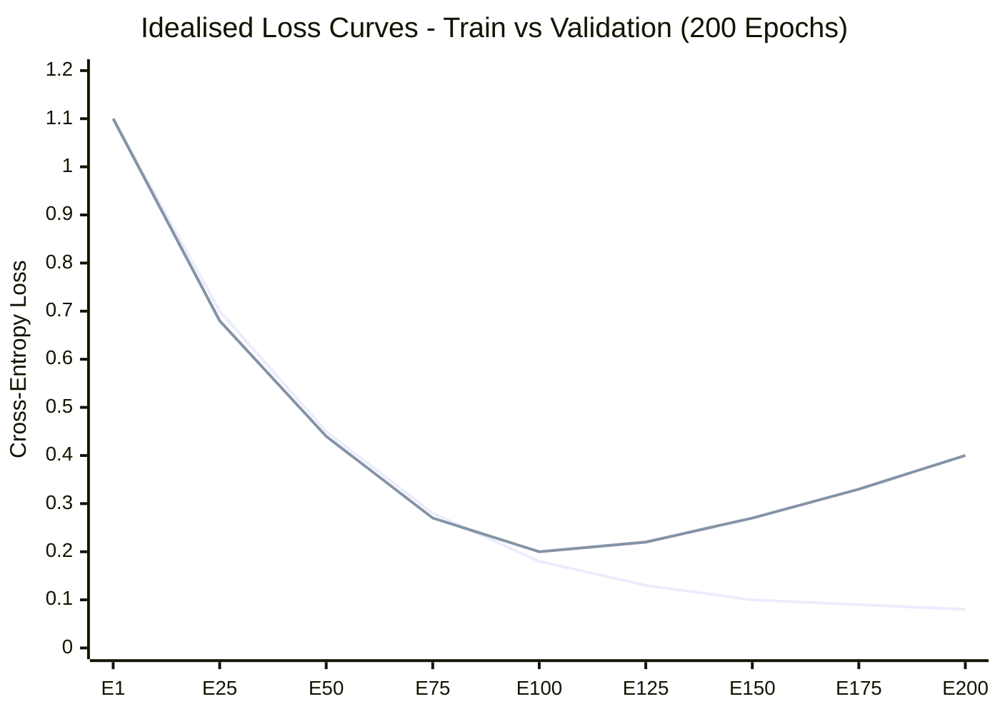

> **Blue line = training loss. Red dashed line = validation loss.**
> The x-axis is the epoch number. The y-axis is the cross-entropy loss value - lower is better.

---

#### What Is a Loss Curve?

A **loss curve** is a line graph that plots how the model's error (its "loss") changes after each training epoch. The loss is a single number produced by the **loss function** - a mathematical formula that measures how wrong the model's predictions are. For a classification problem like this one, that formula is **cross-entropy loss**:

- If the model assigns a high probability to the correct class, the loss is **low** (close to 0). The model was confident and right.
- If the model assigns a low probability to the correct class, the loss is **high**. The model was wrong or uncertain.

There are always **two loss curves** plotted together:

| # | Curve | What Data Is Used | What It Measures |
|---|---|---|---|
| 1 | Training loss (blue) | The 800 samples the model learns from directly | How well the model fits the data it was trained on |
| 2 | Validation loss (red dashed) | The 200 held-out samples the model never trains on | How well the model generalises to unseen data |

The validation loss is the more important signal. Training loss tells you how hard the model is working. Validation loss tells you whether that work is actually useful.

---

#### What the Diagram Is Showing

The chart above is an **idealised** version of what Notebook Section 5 produces when you run the overfitting experiment. Reading it left to right, you are watching the model learn across 200 epochs:

- **Epochs 1-75 (both lines falling together):** This is healthy learning. The model is extracting real patterns from the data and those patterns generalise - both splits improve simultaneously. This is the zone you want to spend most of your training budget in.
- **Epochs 75-125 (lines separating, validation flattening):** The model is approaching convergence. Training loss is still improving but validation loss has stopped. The model has learned everything genuinely useful from the data and is now starting to specialise to the specific training examples.
- **Epochs 125-200 (lines diverging - validation rises, training still falls):** This is **overfitting onset**. The model is now memorising noise, quirks, and specific patterns in the training set that do not exist in the real world. Training loss falls because the model gets better at reproducing the training data exactly. Validation loss rises because that memorisation actively hurts performance on unseen data.

---

#### What Each Possible Pattern Means

| # | What You See | What It Means | What to Do |
|---|---|---|---|
| 1 | **Both lines fall together and then level off at a low value** | Healthy convergence - this is the ideal outcome | Stop training here or use early stopping to catch this point automatically |
| 2 | **Both lines keep falling through all epochs with no flattening** | Model has not converged yet - needs more epochs | Train longer or increase the learning rate |
| 3 | **Both lines are flat and high from the start** | Underfitting - model is too small or learning rate is too low to learn anything | Use a larger model or a higher learning rate |
| 4 | **Validation rises while training falls** | Overfitting - this is what Diagram 5 shows in the final quarter | Stop earlier (use the best-epoch checkpoint), add dropout, add weight decay, or reduce model size |
| 5 | **Validation loss is erratic / spiky** | Mini-batch noise - validation set may be too small, or learning rate too high | Increase validation set size or reduce the learning rate |

---

#### Is This the Ideal Loss Curve?

**No.** The curve in Diagram 5 is intentionally showing a **problem**, not a goal. It is the expected result of the overfitting experiment in Notebook Section 5, which uses a large model, clean data, 300 epochs, and no dropout - conditions designed to force overfitting.

The **ideal** loss curve looks like rows 1 in the table above: both lines fall together, converge smoothly, and then plateau at a low stable value with minimal gap between them. That would mean:

- The model learned a generalisable pattern (validation loss is low).
- Training did not go on so long that memorisation took over (no upward turn on validation).
- The model is neither underfitted nor overfitted.

The gap between the training and validation lines at any given epoch is called the **generalisation gap**. A small gap means the model behaves almost as well on unseen data as it does on training data - that is the target. The growing gap visible from epoch 125 onward in Diagram 5 is the quantitative measure of how badly the model is overfitting.

---

#### What to Watch For in Your Own Experiments

The single most important habit when training any model is to **always plot both curves together** and watch for these signals:

1. **The moment validation loss stops falling** - that epoch is your best checkpoint. Save it. Everything after that epoch is the model getting worse at generalisation, even if it looks like it is getting better on training data.
2. **A large and growing gap between the two lines** - the size of that gap tells you how overfit the model is. A gap of 0.30 or more (as seen at epoch 200 in Diagram 5) is a strong signal to stop earlier, reduce model capacity, or add regularisation.
3. **If both lines keep falling with no sign of flattening** - you have not trained long enough. The model has more to learn. Increase your epoch budget.
4. **If both lines are high and flat** - the model is not learning at all. Check your learning rate, model architecture, and data pipeline first.

> [!NOTE]
> The chart above shows an **idealised** trajectory using the `medium` capacity preset at default settings. In practice the curves will be noisier, especially early in training when mini-batch gradient estimates have high variance. Smoother curves are a sign of a larger batch size, stronger regularisation, or a lower learning rate. The exact epoch at which validation loss bottoms out varies between runs and depends on all hyperparameters simultaneously. Use the "Finding the Optimal Stopping Point" plot in Notebook Section 3 to identify the best checkpoint for your specific run.

---

### Diagram 6  -  Idealised Accuracy Curves Across Epochs

The accuracy curve is the mirror image of the loss curve viewed from the opposite direction - instead of measuring how wrong the model is, it measures how often it is right. Both tell the same story, but accuracy is easier to interpret at a glance (90% correct is more intuitive than a loss of 0.105).

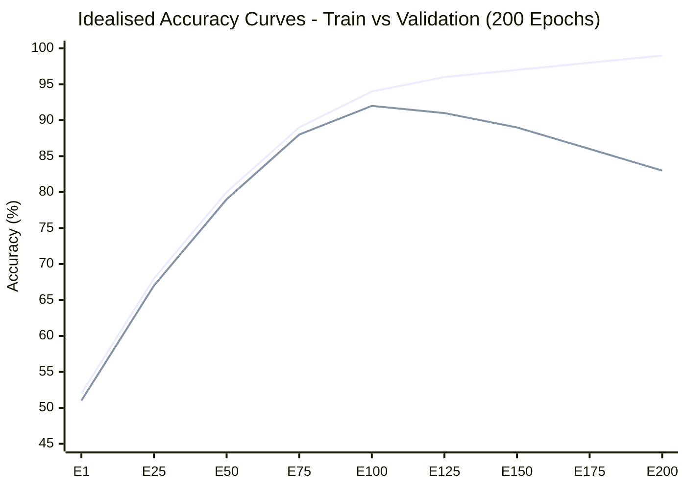

> **Blue line = training accuracy. Orange dashed line = validation accuracy.**
> Training accuracy climbs all the way to ~99% while validation accuracy peaks around epoch 100 and then slowly drops - the accuracy mirror of the diverging loss curves in Diagram 5.

The growing gap between the two accuracy lines after epoch 100 is the **accuracy generalisation gap** - the same overfitting signal, expressed as a percentage rather than a loss value. A model that is 99% accurate on training data but only 83% accurate on unseen data has learned 16 percentage points worth of noise. That noise is useless in production.

> [!TIP]
> When validation accuracy stops rising (even if training accuracy keeps climbing), that is your stop signal. The epoch where validation accuracy peaks is the same epoch where validation loss is at its minimum - they always agree. Use whichever curve you find easier to interpret. Most practitioners watch validation loss because it is more sensitive to small changes than accuracy.

---

### Diagram 7  -  The Four Training Phases Timeline

Every training run passes through four distinct phases regardless of model size or dataset. The shape of the loss and accuracy curves changes character at each phase boundary. This diagram maps those phases onto a 200-epoch timeline with the expected metric behaviour at each stage.

```mermaid
gantt
    title Four Phases of Training  -  200 Epoch Run (medium preset, default settings)
    dateFormat  X
    axisFormat  Epoch %s

    section Phase 1 - Underfitting
    Both losses high, falling fast. Boundary is a rough line.   :crit, p1, 1, 30

    section Phase 2 - Learning
    Both losses fall together. Boundary curves toward moons.    :active, p2, 30, 100

    section Phase 3 - Convergence
    Losses flatten. Boundary stable. Best generalisation here.  :done, p3, 100, 150

    section Phase 4 - Overfitting
    Val loss rises. Train loss still falls. Gap widens.         :crit, p4, 150, 200
```

> [!NOTE]
> The phase boundaries above are approximate for the `medium` preset at default settings (1,000 samples, noise=0.20, lr=1e-3). With the `overfit` preset the model can reach Phase 4 as early as epoch 30. With the `tiny` preset the model may never leave Phase 1 no matter how many epochs you run.

---

### Diagram 8  -  Bias-Variance Tradeoff vs Epoch Count

The fundamental tension in machine learning is between **bias** (being too simple to capture the pattern) and **variance** (being so sensitive to training data that noise is captured as signal). Epoch count directly controls where you sit on this spectrum.

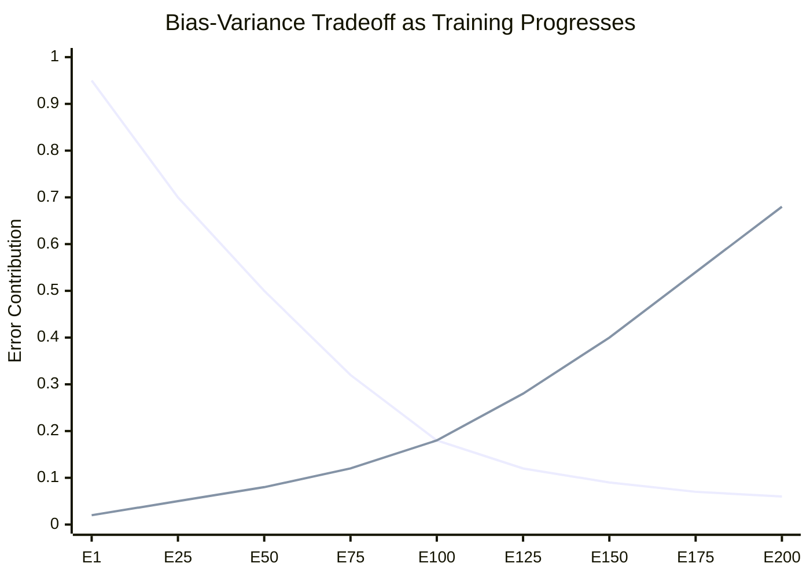

> **Blue line = bias error (underfitting). Red line = variance error (overfitting).**
> Total generalisation error is the sum of both lines. The lowest point of that sum - around epoch 100 here - is the sweet spot where the model is neither too rigid nor too flexible.

| # | Zone | Dominant Error | What the Model Is Doing | Remedy |
|---|---|---|---|---|
| 1 | Epochs 1-30 | High bias | Too simple - ignores real patterns in the data | Keep training |
| 2 | Epochs 30-100 | Balanced | Learning real signal - both errors decreasing | Stay in this zone |
| 3 | Epochs 100-125 | Transition | Bias near zero, variance starting to grow | Best stopping region |
| 4 | Epochs 125-200 | High variance | Memorising noise - variance dominates | Stop, regularise, or reduce model size |

---

### Diagram 9  -  Cosine Annealing Learning Rate Schedule

The learning rate is the single most important hyperparameter in gradient descent. This project uses **cosine annealing** - a schedule that starts the learning rate high (for fast early learning) and smoothly reduces it to near zero following a cosine curve, allowing precise fine-tuning near convergence.

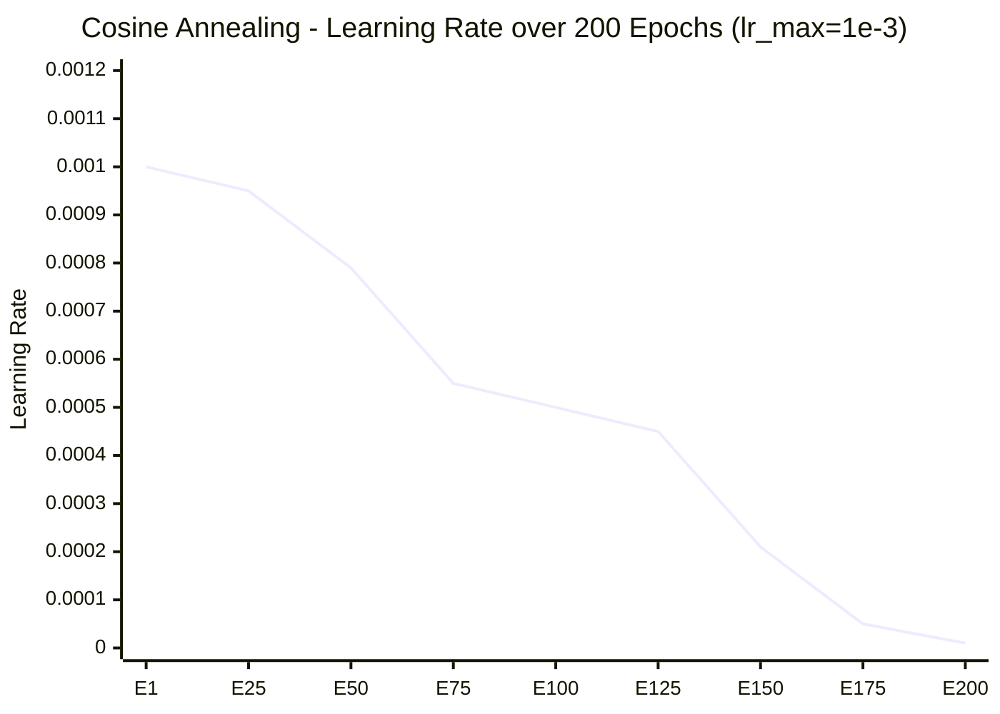

> The learning rate starts at `1e-3` and decays following `lr = lr_max * 0.5 * (1 + cos(pi * epoch / total_epochs))`. By epoch 200 it is near zero, producing very small, precise weight updates that can no longer destabilise the converged solution.

Why this matters for the loss curves:

- **Early epochs (high lr):** Large weight updates mean the model covers a lot of ground quickly - loss falls steeply. There is a risk of overshooting a good minimum.
- **Middle epochs (medium lr):** Updates are moderate - the model is refining rather than exploring. Loss curve slope gradually flattens.
- **Late epochs (low lr):** Updates are tiny - the model can no longer escape its current configuration even if it wanted to. Loss curve becomes nearly flat. This is why the training loss curve in Diagram 5 levels off rather than continuing to fall indefinitely.

> [!NOTE]
> If validation loss starts rising while the learning rate is still high, that is a stronger overfitting signal than if it rises only after the learning rate has decayed to near zero. A low learning rate by itself can mask overfitting by preventing further weight changes - the model is overfit but frozen in place.

---

### Diagram 10  -  Gradient Descent: One Weight Update Step

This diagram zooms in to the single most fundamental operation in all of deep learning - one weight update step for one parameter. Every epoch contains approximately 16 of these steps (one per mini-batch). Over 200 epochs that is roughly 3,200 individual updates per weight.

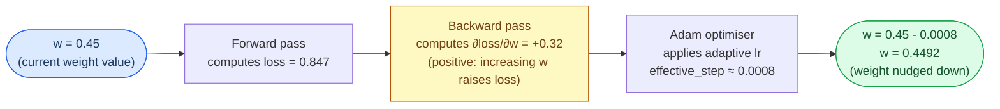

> The gradient `+0.32` tells the optimiser: "this weight is currently pulling the loss upward." The optimiser subtracts a small fraction of that gradient from the weight. After thousands of such nudges across all ~4,700 weights, the model reaches a configuration where no single weight can be adjusted to lower the loss further - that is convergence.

The three outcomes of this process across epochs:

- **Too few epochs:** Each weight only gets a handful of nudges - not enough to move far from its random starting value. The model is still largely random. High loss, poor accuracy.
- **Right number of epochs:** After ~3,200 nudges the weights have settled into a configuration that correctly separates the two moon classes. Loss is low and stable on both splits.
- **Too many epochs:** The nudges continue past the point of useful learning. Weights start encoding the exact positions of individual training points rather than the smooth underlying curve. Validation loss climbs. Overfitting.

---

## Project Structure

The repository follows a clean separation between source code, notebooks, generated artifacts, and configuration files. Every folder and file has a single purpose. The `outputs/` and `checkpoints/` directories are generated at runtime and are excluded from version control by `.gitignore`.

```
epochs-demo/
├── README.md                      - This file
├── CONTRIBUTING.md                - Contribution workflow and expectations
├── .gitignore                     - Git exclusions for local and generated files
├── requirements.txt               - Pinned dependency list
│
├── .github/                       - GitHub issue and pull request templates
│   ├── ISSUE_TEMPLATE/
│   │   ├── bug_report.yml         - Structured bug report form
│   │   ├── feature_request.yml    - Feature suggestion form
│   │   └── config.yml             - Template chooser configuration
│   └── PULL_REQUEST_TEMPLATE.md   - PR checklist for contributors
│
├── src/                           - All source code
│   ├── data.py                    - Dataset generation and DataLoader creation
│   ├── model.py                   - MLP architecture and capacity factory
│   ├── train.py                   - Training loop with checkpointing
│   ├── evaluate.py                - Post-training metrics and classification report
│   ├── visualize.py               - All plotting and animation functions
│   ├── utils.py                   - Seeding, device detection, checkpoint I/O
│   └── main.py                    - CLI entry-point that wires everything together
│
├── notebooks/
│   └── epoch_analysis.ipynb       - Interactive Jupyter analysis and comparison
│
├── checkpoints/                   - Auto-created at runtime: .pt weight snapshots
│   ├── epoch_0001.pt
│   ├── epoch_0050.pt
│   └── ...
│
└── outputs/                       - Auto-created at runtime: all generated plots
    ├── loss_curve.png
    ├── accuracy_curve.png
    ├── boundary_epoch_XXXX.png
    ├── epoch_snapshots.png
    ├── training_animation.gif      - Only generated with --animate flag
    └── history.json               - Raw per-epoch metrics for notebook use
```

---

## Module Reference

<details>
<summary><strong>📦 src/data.py  -  Dataset Generation and DataLoaders</strong></summary>

`data.py` is responsible for generating the synthetic training data and packaging it into PyTorch `DataLoader` objects that the training loop can iterate over. It uses scikit-learn's `make_moons` function to produce a two-class, two-dimensional dataset where the optimal decision boundary is a smooth non-linear curve. This choice is intentional: a linear boundary (like the one produced by `make_blobs` with well-separated clusters) would not demonstrate the need for a non-linear model, and the epoch effects would be far less visually striking.

The module exposes two public functions. `generate_dataset` returns raw NumPy arrays and is used when you need the full dataset for visualisation. `get_dataloaders` wraps those arrays into a `TensorDataset` and splits them into training and validation sets using a seeded `random_split`, then returns two `DataLoader` objects plus the full raw arrays for downstream boundary plotting.

| # | Function | Key Parameters | Returns | Purpose |
|---|---|---|---|---|
| 1 | `generate_dataset` | `n_samples`, `noise`, `random_state` | `(X: ndarray, y: ndarray)` | Raw NumPy arrays for the full dataset before splitting |
| 2 | `get_dataloaders` | `n_samples`, `noise`, `batch_size`, `val_split`, `random_state` | `(train_loader, val_loader, X_all, y_all)` | Ready-to-use DataLoaders plus raw arrays for visualisation |

The `val_split` parameter (default `0.20`) controls what fraction of the data is held out for validation. With 1,000 samples and `val_split=0.20`, the training set has 800 samples and the validation set has 200 samples. The split is performed with a seeded generator, ensuring the train/val partition is identical across every run as long as `random_state` is unchanged  -  which is essential for fair comparison between experiments.

</details>

<details>
<summary><strong>🧱 src/model.py  -  MLP Architecture and Capacity Factory</strong></summary>

`model.py` defines the neural network architecture used throughout the project. The `MLP` class is a fully-connected feed-forward network built from stacked `nn.Linear` layers. Each hidden layer is followed by `nn.BatchNorm1d` (batch normalisation), `nn.ReLU` (the activation function), and optionally `nn.Dropout`. The final linear layer maps to 2 output logits  -  one per class.

Batch Normalisation normalises each layer's inputs to have approximately zero mean and unit variance across the mini-batch, which stabilises training by reducing the problem of internal covariate shift. Covariate shift occurs when the distribution of a layer's inputs keeps changing as earlier layers update their weights, forcing later layers to constantly re-adapt. By normalising layer inputs, BN allows higher learning rates and faster convergence, and also acts as a mild regulariser by adding noise proportional to the batch statistics.

Dropout is a regularisation technique that randomly sets a fraction of neuron activations to zero during each training forward pass. This forces different subsets of neurons to independently learn to represent the same features, creating redundancy that makes the network more robust. During inference, Dropout is disabled and activations are scaled by `(1 - dropout_rate)` to maintain the same expected output magnitude.

The `build_model` factory function accepts a `capacity` string and returns a correctly configured `MLP` instance. This abstraction shields `main.py` and the notebook from knowing the exact hidden-layer sizes  -  they simply request `"medium"` or `"overfit"` and get the right architecture.

| # | Preset | Hidden Layers | Dropout | Approx Params | Best Demonstrates |
|---|---|---|---|---|---|
| 1 | `tiny` | `[8]` | 0.0 | ~150 | Structural underfitting regardless of epoch count |
| 2 | `small` | `[32, 16]` | 0.0 | ~700 | Mild underfitting with too few epochs |
| 3 | `medium` | `[64, 64]` | 0.1 | ~4,700 | Balanced  -  converges cleanly, the recommended default |
| 4 | `large` | `[128, 128, 64]` | 0.2 | ~26,000 | Regularised high capacity, slow to overfit |
| 5 | `overfit` | `[256, 256, 256, 128]` | 0.0 | ~200,000 | Deliberately oversized  -  overfits rapidly |

</details>

<details>
<summary><strong>🔁 src/train.py  -  Training Loop and Checkpointing</strong></summary>

`train.py` contains the core training logic. The `train` function accepts a model, two DataLoaders, an optimiser, a scheduler, and training configuration, then runs `num_epochs` complete passes over the training data. It returns a `history` dictionary containing four lists  -  `train_loss`, `val_loss`, `train_acc`, `val_acc`  -  each of length `num_epochs`. These lists are the primary data artifact of the project and power all downstream visualisations and the Jupyter notebook analysis.

The internal `_run_epoch` helper is shared between training and validation passes. When `training=True`, it calls `optimizer.zero_grad()`, computes the forward pass, calls `loss.backward()`, and then calls `optimizer.step()`. When `training=False`, it wraps everything in `torch.no_grad()` and skips all weight-update steps, which saves memory, prevents gradient tape contamination, and ensures the model is evaluated in inference mode (which disables Dropout and uses running statistics in BatchNorm rather than batch statistics).

The `save_epochs` parameter controls which epoch numbers trigger a checkpoint save. By default, checkpoints are saved at epochs 1, 25%, 50%, 75%, and 100% of the total run, producing five evenly-spaced snapshots that span the complete underfitting-to-overfitting spectrum. Each checkpoint is saved as `epoch_XXXX.pt` where `XXXX` is the zero-padded epoch number.

</details>

<details>
<summary><strong>📊 src/visualize.py  -  Plotting and Animation</strong></summary>

`visualize.py` exposes five public plotting functions, each writing one output file to the `outputs/` directory. All functions accept a `show=False` keyword argument: pass `show=True` to display plots interactively in a GUI window, or leave it `False` (the default) for headless/scripted execution where plots should only be written to disk. All functions also accept an `output_dir` parameter to redirect output to a different folder, which the experiments guide uses to keep results from different runs separate.

| # | Function | Output File | What It Shows |
|---|---|---|---|
| 1 | `plot_loss_curve` | `loss_curve.png` | Train and val loss over all epochs with colour-coded phase regions |
| 2 | `plot_accuracy_curve` | `accuracy_curve.png` | Train and val accuracy over all epochs as percentages |
| 3 | `plot_decision_boundary` | `boundary_epoch_XXXX.png` | Full-resolution contourf boundary for a single model at a single epoch |
| 4 | `plot_epoch_snapshots` | `epoch_snapshots.png` | Multi-panel grid comparing boundaries at all saved checkpoint epochs |
| 5 | `animate_training` | `training_animation.gif` | Animated GIF cycling through all checkpoint boundaries at 4 fps |

Decision boundaries are produced by building a 300x300 meshgrid over the feature space, passing all 90,000 grid points through the model in a single batched `torch.no_grad()` forward call, mapping the resulting class-1 softmax probability to a colour scale (blue = low probability of class 1, red = high), and drawing the 0.5-probability contour line as the decision boundary.

</details>

<details>
<summary><strong>🛠️ src/utils.py  -  Shared Helpers</strong></summary>

`utils.py` provides six utility functions that are used by multiple modules. Centralising these prevents code duplication and ensures consistent behaviour across the codebase. No module should re-implement seeding, device detection, or checkpoint I/O  -  it should always call `utils.py` instead.

| # | Function | Signature | Purpose |
|---|---|---|---|
| 1 | `seed_everything` | `seed: int` | Sets Python, NumPy, and PyTorch RNG seeds simultaneously for full reproducibility |
| 2 | `get_device` | `()` | Returns the best available `torch.device`: CUDA > MPS (Apple Silicon) > CPU |
| 3 | `save_checkpoint` | `model, epoch, metrics, path` | Saves model `state_dict` plus metadata to a `.pt` file |
| 4 | `load_checkpoint` | `model, path, device` | Loads weights from a `.pt` file into an existing model instance |
| 5 | `save_history` | `history, path` | Serialises the training history dict to `history.json` |
| 6 | `load_history` | `path` | Deserialises `history.json` back into a Python dict for plotting |

</details>

<details>
<summary><strong>📈 src/evaluate.py  -  Post-Training Metrics</strong></summary>

`evaluate.py` runs after training completes and produces a detailed classification report using scikit-learn's `classification_report`. It loads the final checkpoint, runs the model in inference mode over the full dataset, and prints precision, recall, F1-score, and support for each class. This is useful for confirming that the model achieves roughly equal performance on both classes  -  an important check because accuracy alone can be misleading if one class is more common than the other.

The module also computes and prints the confusion matrix, which shows the exact counts of true positives, true negatives, false positives, and false negatives. For a well-trained medium model on default settings, you should see a nearly diagonal confusion matrix, indicating that both classes are classified correctly with roughly equal reliability.

</details>

<details>
<summary><strong>⌨️ src/main.py  -  CLI Entry Point</strong></summary>

`main.py` is the single entry point for all training runs. It uses Python's `argparse` module to define the command-line interface, parses the arguments, calls `utils.seed_everything`, calls `utils.get_device`, orchestrates calls to `data.get_dataloaders`, `model.build_model`, `train.train`, `evaluate.evaluate`, and `visualize.*` in sequence, and then exits. Every other module is a library  -  `main.py` is the only place where the full pipeline is assembled.

</details>

---

## Quick Start

### Prerequisites

This project requires Python 3.10 or later, a terminal (bash, zsh, PowerShell, or Command Prompt), and approximately 2 GB of disk space for the PyTorch installation. No GPU is required  -  the two-moons dataset and medium MLP are specifically designed to run fast on CPU, typically completing 200 epochs in under 30 seconds on any modern laptop.

### Installation

```bash
# Navigate to the project directory
cd /path/to/epochs-demo

# Create an isolated virtual environment (keeps this project's dependencies separate)
python -m venv .venv

# Activate the virtual environment
source .venv/bin/activate          # Linux / macOS
# .venv\Scripts\activate           # Windows PowerShell

# Install all pinned dependencies from requirements.txt
pip install -r requirements.txt
```

> [!NOTE]
> Always activate the virtual environment before running any Python command in this project. You can tell it is active because your terminal prompt will show `(.venv)` at the beginning. If you see `ModuleNotFoundError: No module named 'torch'`, it means Python is running from the system installation rather than the virtual environment  -  re-run `source .venv/bin/activate`.

### Run Training

```bash
# Standard run: 200 epochs, medium MLP, default settings  -  the recommended starting point
python src/main.py

# Generate boundary animation (writes training_animation.gif to outputs/)
python src/main.py --animate

# Demonstrate overfitting: large model, many epochs, low noise
python src/main.py --capacity overfit --epochs 500 --noise 0.05

# Demonstrate structural underfitting: model is too small to learn the boundary
python src/main.py --capacity tiny --epochs 200

# Demonstrate epoch-count underfitting: capable model, but not enough training time
python src/main.py --capacity medium --epochs 5

# Display each plot interactively as it is generated
python src/main.py --show-plots
```

### Run the Notebook

```bash
# Start Jupyter in the project root (after running training at least once)
jupyter notebook notebooks/epoch_analysis.ipynb
```

> [!TIP]
> Run `python src/main.py` at least once before opening the notebook. The notebook loads `outputs/history.json` and checkpoint files from `checkpoints/*.pt` that are produced by the training script. Without them, several cells will raise `FileNotFoundError`. If you want to analyse a specific experiment, update the `HISTORY_PATH` and `CKPT_DIR` variables at the top of the notebook to point to the correct output directories.

---

## CLI Options

The `main.py` entry-point accepts the following command-line arguments. All arguments are optional and have defaults that produce a complete, educational demonstration out of the box. No flags are required for a first run.

| # | Flag | Type | Default | Valid Range | Description |
|---|---|---|---|---|---|
| 1 | `--epochs` | int | 200 | 1 - 10,000 | Total number of training epochs to run |
| 2 | `--batch-size` | int | 64 | 1 - n_samples | Mini-batch size fed to the model per gradient step |
| 3 | `--lr` | float | 0.01 | 1e-5 - 1.0 | Initial learning rate for the Adam optimiser |
| 4 | `--noise` | float | 0.20 | 0.0 - 1.0 | Gaussian noise standard deviation added to data coordinates |
| 5 | `--n-samples` | int | 1,000 | 100 - 100,000 | Total number of data points to generate |
| 6 | `--capacity` | str | medium | tiny/small/medium/large/overfit | Model size preset controlling hidden layer widths and dropout |
| 7 | `--seed` | int | 42 | any int | Master RNG seed for full reproducibility across runs |
| 8 | `--output-dir` | str | outputs | any valid path | Directory where PNG and JSON artifacts are written |
| 9 | `--ckpt-dir` | str | checkpoints | any valid path | Directory where `.pt` checkpoint files are saved |
| 10 | `--animate` | flag | off | present / absent | If present, generate a GIF animation of boundary evolution |
| 11 | `--show-plots` | flag | off | present / absent | If present, open each plot in an interactive GUI window |

> [!TIP]
> Use `--output-dir` and `--ckpt-dir` to give each experiment a unique folder so runs do not overwrite each other. For example: `python src/main.py --capacity overfit --output-dir outputs_overfit --ckpt-dir ckpts_overfit`. This makes it easy to compare experiments side by side in the Jupyter notebook by pointing `HISTORY_PATH` at each folder.

---

## Generated Outputs

After a successful run, the `outputs/` directory contains the following files. Each file is self-contained and can be opened and examined independently without re-running the training script.

| # | File | Approx Size | Format | What It Contains |
|---|---|---|---|---|
| 1 | `loss_curve.png` | 60-80 KB | PNG | Train and val loss curves with colour-shaded phase regions (underfitting / learning / convergence / overfitting) annotated |
| 2 | `accuracy_curve.png` | 40-60 KB | PNG | Train and val accuracy curves in percentage form; the gap between lines is the overfitting signal |
| 3 | `boundary_epoch_XXXX.png` | 150-200 KB | PNG | Full-resolution probability surface with the 0.5-contour decision line at the final checkpoint epoch |
| 4 | `epoch_snapshots.png` | 400-700 KB | PNG | Multi-panel grid (up to 3 panels per row) showing the decision boundary at each saved checkpoint epoch |
| 5 | `training_animation.gif` | 1-5 MB | GIF | Animated boundary evolution across all checkpoints at 4 fps; only generated with `--animate` |
| 6 | `history.json` | 3-10 KB | JSON | Raw per-epoch arrays: `train_loss`, `val_loss`, `train_acc`, `val_acc`; used by the Jupyter notebook |

> [!NOTE]
> All output files are **overwritten** on each run with the same `--output-dir`. If you want to preserve results from different experiments, either use a unique `--output-dir` per run or copy the `outputs/` directory to a backup folder before re-running. The `checkpoints/` directory is similarly overwritten unless you use `--ckpt-dir` to redirect it.

---

## How to Interpret the Visualizations

### Loss Curve

The loss curve is the single most important plot for understanding training health. The x-axis is the epoch number; the y-axis is cross-entropy loss, where **lower is better**. Two lines are drawn: training loss (solid blue) and validation loss (dashed red). A well-designed training run shows both lines falling together through the first half of training, the validation line levelling off or very slightly rising in the second half while the training line continues to fall slightly, and the gap between them remaining small throughout.

When **both lines are falling in parallel**, the model is learning genuinely generalisable features  -  this is the healthy learning phase. When **training loss falls but validation loss plateaus**, the model has converged and further training delivers diminishing returns. When **training loss falls while validation loss rises**, overfitting has begun and the model is memorising training noise. When **both lines are flat and high**, the model is structurally underfitting  -  it is either too small to represent the boundary, or the learning rate is too low for any learning to occur.

> [!TIP]
> Print the loss curve and annotate the epoch where validation loss first stops decreasing. That is your optimal checkpoint  -  the model saved at that epoch has the best generalisation performance. In production, this is why **early stopping** is used: training automatically halts when validation loss has not improved for a specified number of epochs (the patience parameter).

### Accuracy Curve

The accuracy curve is complementary to the loss curve and is often easier to interpret intuitively because accuracy has a natural upper bound of 100%. The y-axis shows accuracy as a percentage; higher is better. The gap between the training accuracy line (green) and the validation accuracy line (orange) is a direct, visual measure of overfitting severity. A gap of 1-3% is normal and expected. A gap of 10-15% or more indicates the model has specialised too strongly to the training set.

> [!IMPORTANT]
> Never evaluate a model using training accuracy alone. A model that achieves 100% training accuracy but only 60% validation accuracy has learned nothing useful  -  it has simply memorised the training set. Always report validation accuracy, and ideally also evaluate on a third hold-out test set that was never seen during training or hyperparameter tuning.

### Decision Boundary Snapshots

The snapshot grid shows how the model's learned boundary evolves from random initialisation to a fully trained state. Each panel displays the same scatter plot of data points, coloured by true class label, overlaid with a continuous probability surface (red = high P(class=1), blue = low P(class=1)) and the 0.5 decision contour drawn as a thick black line. Reading the panels left-to-right, top-to-bottom traces the complete learning story:

At **epoch 1** the boundary is essentially random  -  a roughly straight or gently curved line that does not follow the moon shapes at all, because the weights are still close to their random initialisation. In the **early-middle epochs** the boundary begins curving and roughly separating the two crescents, but with large regions of misclassification still visible. In the **later-middle epochs** the boundary tightens around the true moon shapes, with fewer and fewer points on the wrong side of the line. At the **final epoch with the medium model** the boundary is a smooth, clean curve that closely approximates the true boundary. At the **final epoch with the overfit model at low noise**, the boundary becomes jagged and over-complex  -  it threads through individual training points and no longer looks like a smooth curve at all.

### Animation

The animation loops through all saved checkpoint panels sequentially at 4 frames per second, making the progressive learning process visible as a continuous transition rather than a static grid. Watch for the frame where the boundary stops visibly changing  -  that is approximately your convergence point. With the `overfit` preset, continue watching past convergence and observe the boundary becoming increasingly jagged as the model starts memorising noise.

---

## Dataset Details

This project uses **scikit-learn's `make_moons`** synthetic dataset. Two interleaved crescent (moon) shapes are generated in a 2-D feature space, with one class forming the upper crescent and the other the lower crescent. The degree of overlap between the classes is controlled by the `noise` parameter, which adds Gaussian noise to the (x, y) coordinates of each data point  -  larger noise spreads points further from their ideal moon positions, increasing class overlap and making perfect classification impossible.

The two-moons dataset was chosen for this project because it satisfies four requirements simultaneously: it **requires a non-linear decision boundary** (a linear model always underfits, making model capacity effects visible), it is **two-dimensional** (so boundaries can be plotted directly without dimensionality reduction), it is **generated instantly in memory** (no data files, no downloads, no external dependencies), and its **noise parameter is a single continuous knob** that controls task difficulty and makes it easy to design targeted experiments.

| # | Parameter | Default | Effect When Increased |
|---|---|---|---|
| 1 | `n_samples` | 1,000 | More data points; reduces overfitting risk; slower per-epoch training time |
| 2 | `noise` | 0.20 | More class overlap; lower maximum achievable accuracy; overfitting appears sooner |
| 3 | `val_split` | 0.20 | Larger validation set; more reliable val metrics; smaller training set |
| 4 | `random_state` | 42 | Different integer produces a different point layout; same integer guarantees identical runs |
| 5 | `batch_size` | 64 | Larger batch = smoother gradients, more stable training, more memory; smaller batch = noisier updates, sometimes better generalisation |

> [!NOTE]
> With `noise=0.0` (no noise), the data is perfectly separable and even a small model will achieve ~100% validation accuracy given enough epochs. With `noise=0.50`, the classes overlap so heavily that even a large model cannot exceed ~80% accuracy because many points are genuinely ambiguous  -  they could plausibly belong to either class. The default `noise=0.20` is chosen to sit in the interesting middle ground where a well-trained model achieves 94-97% accuracy and the boundary is clearly non-trivial but achievable.

---

## Model Capacity Presets

Model **capacity** refers to the total number of learnable parameters in the network, which determines the maximum complexity of function the model can represent. A model with insufficient capacity cannot fit the training data no matter how many epochs you run  -  this is called **structural underfitting** and is fundamentally different from **epoch-count underfitting** (where the model has enough capacity but has not been trained long enough). Understanding this distinction is crucial: if your model is structurally underfitting, more epochs will not help  -  you need a larger model.

A model with excess capacity, on the other hand, can memorise arbitrary noise given enough training time. This is called overfitting by over-parameterisation. The solution is not to reduce the model size (which would hurt performance on harder tasks) but to apply **regularisation**  -  dropout, weight decay, data augmentation, or early stopping  -  which constrains the model's tendency to memorise while preserving its ability to represent complex patterns.

| # | Preset | Architecture | Total Params | Dropout | Intended Demonstration |
|---|---|---|---|---|---|
| 1 | `tiny` | `Linear(2→8) → BN → ReLU → Linear(8→2)` | ~150 | None | Model too small to learn the moon boundary at any epoch count |
| 2 | `small` | `2→32→16→2` | ~700 | None | Borderline capacity; needs many epochs; mild underfitting persists |
| 3 | `medium` | `2→64→64→2` | ~4,700 | 10% | Well-matched to task; clean convergence by ~150 epochs; the default |
| 4 | `large` | `2→128→128→64→2` | ~26,000 | 20% | Excess capacity but strongly regularised; overfits only at very high epochs |
| 5 | `overfit` | `2→256→256→256→128→2` | ~200,000 | None | Massively over-parameterised; overfits rapidly even with `noise=0.20` |

> [!CAUTION]
> The `overfit` preset deliberately removes all dropout regularisation to make overfitting happen as fast and as visibly as possible. This is a teaching tool, not a template. In production, large models should always include dropout, weight decay, or both. Removing regularisation from a large model trained on a small dataset is a reliable recipe for a model that performs well on paper (training metrics) but fails in deployment (real-world data).

---

## Checkpoint Format

Each checkpoint file saved by `utils.save_checkpoint` is a PyTorch `.pt` file containing a Python dictionary with the following keys. You can load and inspect any checkpoint directly in Python without running the full training pipeline.

| # | Key | Type | Description |
|---|---|---|---|
| 1 | `epoch` | int | The epoch number at which this checkpoint was saved (1-indexed) |
| 2 | `model_state_dict` | OrderedDict | The full weight and bias tensors for every layer in the MLP |
| 3 | `train_loss` | float | Mean cross-entropy loss on the training set at this epoch |
| 4 | `val_loss` | float | Mean cross-entropy loss on the validation set at this epoch |
| 5 | `train_acc` | float | Mean accuracy on the training set at this epoch (0.0 - 1.0) |
| 6 | `val_acc` | float | Mean accuracy on the validation set at this epoch (0.0 - 1.0) |
| 7 | `capacity` | str | The model capacity preset string used to create the model |

```python
import torch

# Load and inspect a checkpoint
ckpt = torch.load("checkpoints/epoch_0050.pt", map_location="cpu")
print(f"Epoch: {ckpt['epoch']}")
print(f"Val accuracy: {ckpt['val_acc']:.2%}")
print(f"Layers: {list(ckpt['model_state_dict'].keys())[:4]}")
```

> [!TIP]
> To resume training from a checkpoint, load the `model_state_dict` into a freshly constructed `MLP`, then also restore the optimiser state (if you saved it) and the scheduler state. In this demo project checkpoints only save model weights, not optimiser or scheduler state  -  which means resumed training will reset the learning rate. For production checkpointing patterns see the [PyTorch documentation on saving and loading models](https://pytorch.org/tutorials/beginner/saving_loading_models.html).

---

## Hyperparameter Effects

Understanding how each hyperparameter affects training helps you design targeted experiments and diagnose problems. The table below summarises the first-order effects of changing each hyperparameter independently while holding all others at their default values.

| # | Hyperparameter | Default | Increase Effect | Decrease Effect | Primary Tradeoff |
|---|---|---|---|---|---|
| 1 | `--epochs` | 200 | More training time; risk of overfitting at high values | Less training; risk of underfitting | Underfitting vs overfitting |
| 2 | `--lr` | 0.01 | Faster early learning; risk of divergence or oscillation | Slower learning; more stable but may not converge in budget | Speed vs stability |
| 3 | `--batch-size` | 64 | Smoother gradients; more stable; needs more memory | Noisier gradients; sometimes better generalisation; less memory | Stability vs generalisation |
| 4 | `--noise` | 0.20 | Harder task; lower ceiling accuracy; overfitting appears earlier | Easier task; higher accuracy; boundary more dramatic | Task difficulty |
| 5 | `--n-samples` | 1,000 | More data; reduces overfitting risk; slower per epoch | Less data; overfitting risk rises sharply | Overfitting risk vs speed |
| 6 | Dropout rate | 0.1 (medium) | Stronger regularisation; higher training loss; better generalisation | Weaker regularisation; easier overfitting | Regularisation strength |
| 7 | Weight decay | 1e-4 | Smaller weights; smoother boundaries; reduced overfitting | Larger weights; potentially higher model complexity | Regularisation strength |

> [!NOTE]
> Hyperparameter interactions are non-linear: doubling the learning rate and halving the batch size are **not** equivalent changes, even though both increase gradient noise. Similarly, increasing model capacity and decreasing regularisation simultaneously amplifies overfitting far more than either change would alone. Always change one hyperparameter at a time when running diagnostic experiments.

---

## Experiments Guide

The following experiments are designed to isolate and demonstrate specific phenomena. Run each experiment with a unique `--output-dir` so the results do not overwrite each other, then compare the loss curves and decision boundary plots side by side.

### Experiment 1  -  Epoch-Count Underfitting

A capable model that has not been trained long enough. The weights are still close to their random initialisation and the decision boundary is barely curved.

```bash
python src/main.py --capacity medium --epochs 5 \
  --output-dir outputs_exp1 --ckpt-dir ckpts_exp1
```

**Expected:** Both loss curves are high and flat. Decision boundary is a crude, nearly straight line. Validation accuracy is around 70-75%. Both training and validation metrics are poor, confirming that the model simply has not had enough time to learn  -  this is underfitting, not overfitting.

---

### Experiment 2  -  Healthy Convergence (Baseline)

The default settings produce a clean convergence story with no overfitting. This is the intended "correct" outcome and serves as a reference point for all other experiments.

```bash
python src/main.py --capacity medium --epochs 200 \
  --output-dir outputs_exp2 --ckpt-dir ckpts_exp2
```

**Expected:** Both loss curves fall together and level off around epoch 100-150. Validation accuracy reaches approximately 95-97%. Decision boundary is a smooth curve following the moon shapes. The training-validation gap is small (under 3%).

---

### Experiment 3  -  Overfitting by Epoch Count and Model Size

A large model with no regularisation, trained on easy (low-noise) data for many epochs. The combination of high capacity, no dropout, and many epochs produces dramatic overfitting that is visible in every output file.

```bash
python src/main.py --capacity overfit --epochs 500 --noise 0.05 \
  --output-dir outputs_exp3 --ckpt-dir ckpts_exp3 --animate
```

**Expected:** Training loss falls close to zero while validation loss bottoms out around epoch 50-100 and then steadily rises. Training accuracy exceeds 99% while validation accuracy plateaus and falls. Decision boundary becomes jagged and over-complex at later epochs. The animation makes the deterioration of the boundary visible as a continuous process.

---

### Experiment 4  -  Structural Underfitting

A model that is too small to represent the decision boundary regardless of how many epochs it trains. Adding more epochs does not help  -  the model simply lacks the capacity to learn the curve.

```bash
python src/main.py --capacity tiny --epochs 300 \
  --output-dir outputs_exp4 --ckpt-dir ckpts_exp4
```

**Expected:** Both loss curves plateau early at a value well above the baseline. The decision boundary never learns the moon shape across all 300 epochs  -  it remains a roughly straight line throughout every checkpoint snapshot. Validation accuracy stays around 75-80% even at epoch 300, demonstrating that the ceiling is architectural rather than a matter of training time.

---

### Experiment 5  -  Effect of Dataset Noise

A medium model trained twice on the same architecture but with different noise levels. The higher noise run will have a lower accuracy ceiling and will overfit sooner, demonstrating how data quality affects the entire training dynamic.

```bash
# Low noise  -  easy task, near-perfect decision boundary
python src/main.py --capacity medium --noise 0.05 \
  --output-dir outputs_lownoise --ckpt-dir ckpts_lownoise

# High noise  -  hard task, overlapping classes, lower ceiling
python src/main.py --capacity medium --noise 0.40 \
  --output-dir outputs_highnoise --ckpt-dir ckpts_highnoise
```

**Expected:** The low-noise run achieves ~99% validation accuracy with a sharp, well-defined boundary. The high-noise run peaks around 82-85% with a fuzzy, uncertain boundary in the overlap region between the two moons.

---

## Dependencies

All dependencies are pinned in `requirements.txt`. Install them with `pip install -r requirements.txt` inside an activated virtual environment. Pinning versions ensures that every run  -  on any machine, at any date  -  uses exactly the same library behaviour, which is critical for reproducible ML experiments.

| # | Package | Min Version | Runtime Role | Why Pinned to This Version |
|---|---|---|---|---|
| 1 | `torch` | 2.0.0 | All model definition, training, and inference | v2.0 introduces `torch.compile()` and significant API cleanup |
| 2 | `torchvision` | 0.15.0 | Companion to torch; ensures ABI compatibility | Must match torch major version exactly |
| 3 | `numpy` | 1.24.0 | Array bridge between sklearn and torch; meshgrid for boundaries | 1.24 fixes dtype inference regressions affecting `float64` default |
| 4 | `matplotlib` | 3.7.0 | All plotting, contourf surfaces, PillowWriter for GIF output | 3.7 introduces improved layout engine used by `tight_layout` |
| 5 | `scikit-learn` | 1.3.0 | `make_moons` dataset; `classification_report`; `confusion_matrix` | 1.3 fixes `random_state` propagation in synthetic generators |
| 6 | `tqdm` | 4.65.0 | Per-epoch progress bar with live train/val metric postfix | 4.65 fixes Windows terminal width detection bug |
| 7 | `jupyter` | 1.0.0 | Notebook server for `epoch_analysis.ipynb` | Meta-package pinned for compatibility with ipykernel |
| 8 | `ipykernel` | 6.0.0 | Python kernel that Jupyter uses to execute notebook cells | Required by both Jupyter Lab and classic Notebook |
| 9 | `Pillow` | 9.0.0 | Backend for `matplotlib.animation.PillowWriter` (GIF export) | Transitive dependency of torchvision; explicit pin for safety |

---

## Troubleshooting

<details>
<summary><strong>❌ ModuleNotFoundError: No module named 'torch'</strong></summary>

You are running Python from the system installation rather than the project's virtual environment. Every `python` and `pip` command must be run with the virtual environment active.

```bash
# Activate the virtual environment first
source .venv/bin/activate          # Linux / macOS
.venv\Scripts\activate             # Windows PowerShell

# Verify the correct Python is active
which python                       # Should show .venv/bin/python

# Then run the script
python src/main.py
```

If the virtual environment does not exist yet, create it: `python -m venv .venv` then install dependencies: `pip install -r requirements.txt`.

</details>

<details>
<summary><strong>❌ FileNotFoundError: outputs/history.json not found</strong></summary>

The notebook or a visualisation function is trying to load training history that has not been generated yet. You must run the training script at least once before using the notebook.

```bash
# Generate all output files
python src/main.py

# Then open the notebook
jupyter notebook notebooks/epoch_analysis.ipynb
```

If you used a custom `--output-dir`, update the `HISTORY_PATH` variable at the top of the notebook to point to the correct directory.

</details>

<details>
<summary><strong>❌ GIF animation not generated (silent failure)</strong></summary>

The `animate_training` function uses `matplotlib.animation.PillowWriter` to write GIF files. PillowWriter requires the `Pillow` library, which is a transitive dependency of `torchvision` but may be absent in minimal environments. Install it explicitly and retry.

```bash
pip install Pillow
python src/main.py --animate
```

</details>

<details>
<summary><strong>⚠️ Training is unexpectedly slow on CPU</strong></summary>

The medium MLP with 200 epochs is designed to complete in under 30 seconds on any modern CPU. If training is slow, check for these common causes: you may have accidentally set `--n-samples` to a very large value (e.g. 50,000 instead of 1,000); you may be using the `overfit` preset (which has ~200,000 parameters and takes significantly longer per epoch); or the virtual environment may have installed the CPU-only version of PyTorch when a CUDA version was expected (check `torch.cuda.is_available()`). For the fastest runs on a GPU machine, ensure the CUDA build of PyTorch is installed  -  see the [PyTorch installation guide](https://pytorch.org/get-started/locally/).

</details>

<details>
<summary><strong>⚠️ Validation accuracy is not reaching ~95%</strong></summary>

The 95-97% target is specific to the default settings: `medium` capacity, `noise=0.20`, `n_samples=1000`, `epochs=200`, `lr=0.01`. Any deviation from defaults can lower the ceiling. Check the following: high `--noise` (try `--noise 0.10`); very small dataset (`--n-samples 200` makes overfitting much worse); wrong capacity (the `tiny` preset cannot physically reach 95%); or an accidentally low learning rate. For the most reliable demonstration of healthy convergence, run `python src/main.py` with no flags at all.

</details>

<details>
<summary><strong>⚠️ Every run produces identical plots even with different seeds</strong></summary>

PyTorch's `DataLoader` uses its own internal RNG that is seeded separately from the global RNG. The `seed_everything` function in `utils.py` sets the global seeds, but if you are using `num_workers > 0` in the DataLoader, the worker processes are seeded independently. This project uses `num_workers=0` (single-process loading) by default, so `seed_everything` provides complete reproducibility. If you modify the DataLoader to use multiple workers, you will need to add a `worker_init_fn` that sets worker-specific seeds.

</details>

---

## Glossary of Terms

Every technical term used in this project is defined below with plain-language explanations aimed at readers who are new to deep learning. Terms appear in alphabetical order, grouped alphabetically. Cross-references help you trace how concepts relate to each other.

<details>
<summary><strong>A – C</strong></summary>

| Term | Full Definition |
|---|---|
| Accuracy | The fraction of predictions the model gets correct out of all predictions made. Computed as `(correct predictions) / (total predictions)` and expressed as a percentage. Accuracy alone can be misleading on imbalanced datasets where one class is far more common than the other  -  see also: Loss, Validation Metrics, F1-Score. |
| Activation Function | A non-linear mathematical function applied to the output of each neuron before it passes to the next layer. Without activation functions, stacking multiple linear layers produces a single linear transformation regardless of depth  -  no additional expressiveness is gained. This project uses ReLU: `f(x) = max(0, x)`, which passes positive values unchanged and outputs zero for negative values. ReLU is fast to compute, avoids the vanishing gradient problem that plagued earlier functions like sigmoid, and produces sparse activations where many neurons output zero. |
| SGD (Stochastic Gradient Descent) | The simplest gradient-based optimiser. Updates every weight by `w = w - lr * gradient` using the same fixed learning rate for every parameter. "Stochastic" means the gradient is computed on a randomly sampled mini-batch rather than the full dataset. SGD is easy to understand and analyse, and with careful learning-rate scheduling and momentum it can match or beat Adam in computer vision tasks. Its main weakness is sensitivity to the choice of learning rate and the need for a separate momentum hyperparameter if desired. |
| Adam Optimiser | Adaptive Moment Estimation  -  a gradient-based optimisation algorithm that maintains a separate, adaptive learning rate for each model parameter. It combines momentum (a running average of past gradient directions) with RMSProp-style scaling (dividing by a running average of squared gradients), so weights that oscillate get smaller steps and stagnant weights get larger ones. In practice Adam converges faster than plain SGD on most tasks and requires less manual tuning of the learning rate. **Known limitation:** Adam applies weight decay incorrectly  -  the L2 penalty is added to the gradient before the adaptive scaling, which means heavily updated parameters receive weaker regularisation than intended. For large models this leads to measurable overfitting. Fixed by AdamW. Used in this project via `torch.optim.Adam` with an initial learning rate of 0.01 and weight decay of 1e-4. |
| AdamW Optimiser | Adam with Decoupled Weight Decay  -  identical to Adam for the gradient update step, but applies the weight-decay penalty as a separate, direct shrinkage of the weights after the update (`w *= 1 - lr * lambda`) rather than folding it into the gradient. This "decoupling" ensures every parameter is regularised by exactly the same proportion regardless of its gradient history. AdamW is the current best-practice default in transformer-based models (BERT, GPT, ViT) and most modern deep learning frameworks. For small models like this project's MLP, the practical difference between Adam and AdamW is negligible. |
| Backpropagation | The algorithm used to compute gradients of the loss with respect to every model parameter. After a forward pass produces a scalar loss value, backpropagation applies the chain rule of calculus layer by layer  -  from the output back to the input  -  computing how much each weight contributed to the final loss. The result is a gradient tensor for every learnable parameter. In PyTorch, backpropagation is triggered by calling `loss.backward()` and the gradients are stored in the `.grad` attribute of each parameter tensor. |
| Batch Normalisation | A technique that normalises the inputs to each layer so they have approximately zero mean and unit variance across the samples in a mini-batch. This stabilises training by reducing internal covariate shift  -  the problem where the distribution of each layer's inputs keeps changing as earlier layers update their weights, forcing later layers to constantly re-adapt. Batch norm allows higher learning rates, speeds up convergence, and acts as a mild regulariser. In this project every hidden layer is immediately followed by `nn.BatchNorm1d`. |
| Batch Size | The number of training samples processed together in one forward-backward pass before the weights are updated once. Larger batches produce smoother, lower-variance gradient estimates but require more memory and can converge to sharp minima that generalise poorly. Smaller batches are noisier but often generalise better and require less memory. The default in this project is 64. See also: Mini-Batch, Gradient Update Step, Stochastic Gradient Descent. |
| Bias-Variance Tradeoff | The fundamental tension in machine learning between two types of error. **Bias** is systematic error from a model that is too simple to capture the true pattern (underfitting). **Variance** is error from a model that is too sensitive to the specific training data (overfitting). Reducing one typically increases the other. Epoch count, model capacity, and regularisation strength are the main levers for navigating this tradeoff. |
| Checkpoint | A file (`.pt` extension in this project) that stores a snapshot of a model's learned weights at a specific point during training. Checkpoints let you compare the model at different training stages, roll back to a better-performing epoch without re-training from scratch, resume an interrupted training run, and load a trained model for inference without re-running training. |
| Convergence | The state reached when the model's weights have stabilised and the loss is no longer decreasing meaningfully with additional gradient steps. Identified on the loss curve as the point where both training and validation loss flatten. Training beyond convergence risks overfitting  -  the model begins fitting noise rather than signal. See also: Early Stopping, Overfitting. |
| Cosine Annealing | A learning rate schedule that reduces the learning rate following the shape of a cosine function from its initial value toward near-zero over `T_max` epochs. It provides fast, large steps early in training when the model is far from its optimum, and slow, precise steps later when the model is near convergence. Used via `torch.optim.lr_scheduler.CosineAnnealingLR`. The key advantage over step-decay schedules is that it requires no manual specification of decay steps. |
| Cross-Entropy Loss | The loss function used in this project for classification. For a correct prediction made with high confidence the loss is near zero; for an incorrect prediction made with high confidence the loss is very large  -  strongly penalising overconfident wrong predictions. For binary classification with `C` classes, cross-entropy is computed as `L = -sum(y_true * log(y_pred))` averaged over the batch. In PyTorch, `nn.CrossEntropyLoss` combines `log_softmax` and negative log-likelihood into one numerically stable operation. |

</details>

<details>
<summary><strong>D – G</strong></summary>

| Term | Full Definition |
|---|---|
| DataLoader | A PyTorch utility class (`torch.utils.data.DataLoader`) that wraps a `Dataset` and provides an iterator over mini-batches. It handles shuffling, batching, and optional parallel data loading using worker processes. In this project one DataLoader is created for training (with `shuffle=True`) and one for validation (with `shuffle=False`). Shuffling the training data each epoch is important because it prevents the model from memorising the sequence of mini-batches rather than their content. |
| Decision Boundary | The surface (or curve in 2-D) in the feature space where the model assigns equal probability to all classes  -  P(class=0) = P(class=1) = 0.5. Points on one side are classified as Class 0; points on the other as Class 1. A well-trained model learns a boundary that closely follows the true boundary of the underlying data distribution. In this project the decision boundary is a curve plotted directly on a 2-D scatter plot, which is only possible because the feature space has exactly two dimensions. |
| Dropout | A regularisation technique where, during each training forward pass, each neuron's activation is set to zero with probability `p` (the dropout rate). This prevents neurons from co-adapting  -  learning to rely on specific other neurons  -  and forces the network to learn redundant representations that are more robust to input variation. Dropout is disabled during inference; activations are scaled by `(1-p)` to maintain the same expected output magnitude. Implemented as `nn.Dropout` in PyTorch. |
| Epoch | One complete pass through the entire training dataset, processing every training sample exactly once in mini-batches. Each epoch produces one entry in the loss and accuracy history lists. The word "epoch" comes from the Greek for a period of time. See: [What Is an Epoch?](#what-is-an-epoch) |
| Early Stopping | A training strategy where training is halted automatically when the validation loss has not improved for a specified number of consecutive epochs (called the patience). Early stopping is the simplest and most robust method for preventing overfitting  -  it stops the model exactly at the point of best generalisation without requiring you to know the right epoch count in advance. This project demonstrates the epoch where early stopping would trigger on the loss curve but does not implement it directly  -  it is left as an exercise. |
| Feature Space | The mathematical space defined by all possible input values to the model. In this project the feature space is 2-D: each sample has exactly two features (the x and y coordinates of a moon point). Because the space is two-dimensional, the decision boundary and probability surface can be plotted directly. In real-world problems feature spaces have hundreds or thousands of dimensions, making direct visualisation impossible without techniques like PCA or t-SNE. |
| Forward Pass | The computation that flows from the input layer through all hidden layers to the output layer, producing a vector of logits. At each layer the input is multiplied by the weight matrix, a bias is added, the result is passed through batch normalisation, and then through the ReLU activation. In PyTorch the forward pass runs by calling `model(x)`, which automatically invokes the `forward()` method. |
| Generalisation | A model's ability to make accurate predictions on data it has never seen during training. Generalisation is measured by the gap between training and validation metrics  -  a small gap indicates good generalisation; a large gap indicates overfitting. The entire purpose of validation during training is to measure generalisation in real time, so you can stop before the model becomes too specialised to the training set. |
| Gradient | A vector that encodes the direction and rate of steepest increase of the loss with respect to each model parameter. The optimiser moves the weights in the direction opposite to the gradient (gradient descent) to reduce the loss. Gradients are computed by backpropagation and temporarily stored in the `.grad` attribute of each PyTorch parameter tensor. Calling `optimizer.zero_grad()` clears these gradients before each new mini-batch. |

</details>

<details>
<summary><strong>H – O</strong></summary>

| Term | Full Definition |
|---|---|
| Hyperparameter | Any configuration value set before training begins that controls the training process but is not learned from the data itself. Examples: epoch count, learning rate, batch size, dropout rate, weight decay, and model architecture (hidden layer sizes). Contrast with model parameters (weights and biases), which are learned automatically. Hyperparameter tuning is the process of searching for the combination that produces the best validation performance. |
| Inference | Running a trained model on new, unseen data to produce predictions without updating any weights. During inference, gradient computation is disabled (`torch.no_grad()`) to save memory and speed up computation. Batch normalisation and Dropout switch to their inference-mode behaviour (using running statistics and disabling random zeroing, respectively). The decision boundary plots are produced by running inference on a 90,000-point grid. |
| Learning Rate | A scalar hyperparameter that controls the size of each weight update step. Too high: the optimiser overshoots minima and the loss oscillates or diverges. Too low: training is extremely slow and may get stuck in poor local minima. The default in this project is 0.01, which is then decayed by cosine annealing over the full training run. The learning rate is the single most important hyperparameter to tune in a new deep learning project. |
| Logits | The raw, unnormalised output scores produced by the final linear layer of the network before any activation is applied. Logits can be any real number. To convert logits to class probabilities, apply softmax. `nn.CrossEntropyLoss` in PyTorch expects raw logits (not softmax outputs) for numerical stability  -  it applies `log_softmax` internally in a single fused operation. |
| Loss | A scalar value that quantifies how wrong the model's current predictions are across a mini-batch or the full dataset. Lower is better. The loss is the quantity being minimised during training. It is computed for every mini-batch, and the average over all batches in one epoch is recorded in the history as `train_loss` or `val_loss`. |
| Mini-Batch | A small subset of the full training dataset (64 samples by default in this project) processed together in one forward-backward pass. Mini-batches balance the computational efficiency of processing many samples simultaneously against the memory cost of loading the full dataset. Each mini-batch produces one gradient estimate and one weight update. |
| MLP (Multi-Layer Perceptron) | A fully-connected feed-forward neural network where every neuron in one layer is connected to every neuron in the next. It is the simplest class of deep neural network. The model in this project is an MLP with configurable depth and width, batch normalisation, ReLU activations, and optional dropout. MLPs are sufficient for the 2-D classification task here and are the foundation on which more complex architectures like CNNs and Transformers are built. |
| Optimiser | An algorithm that uses computed gradients to update the model's weights. This project uses Adam (`torch.optim.Adam`), which adapts the effective learning rate for each parameter individually based on the first and second moments of the gradient history. Other common optimisers include SGD with momentum, AdaGrad, RMSProp, and AdamW. The choice of optimiser affects how quickly the model converges and which local minima it tends to find. |
| Overfitting | The condition where a model has memorised specific training examples rather than the underlying general pattern. An overfit model performs very well on training data but poorly on unseen data. On the loss curve it appears as training loss continuing to fall while validation loss rises. On the decision boundary plot it appears as a jagged, over-complex boundary that threads through individual training points. |

</details>

<details>
<summary><strong>P – Z</strong></summary>

| Term | Full Definition |
|---|---|
| Parameter (model) | The learnable numerical values inside a neural network  -  specifically the weight matrices and bias vectors in each `nn.Linear` layer, and the learnable scale and shift parameters in each `nn.BatchNorm1d` layer. These are updated automatically during training and are saved in checkpoint `.pt` files. Distinct from hyperparameters, which are set manually. |
| ReLU | Rectified Linear Unit  -  the activation function `f(x) = max(0, x)`. Outputs the input unchanged if positive; outputs zero if negative. ReLU is the most widely used activation in modern deep learning because it is computationally cheap, produces sparse activations, avoids the vanishing gradient problem, and in practice trains faster than sigmoid or tanh. |
| Regularisation | Any technique that reduces overfitting by constraining the model's ability to memorise training data. This project uses Dropout (randomly zeroing activations during training) and Weight Decay (L2 penalty on weight magnitudes). Other regularisation methods include data augmentation, early stopping, label smoothing, and mixup. |
| Reproducibility | The ability to run an experiment twice and get identical results. In deep learning this requires seeding all random number generators (Python, NumPy, and PyTorch), using deterministic CUDA operations if using a GPU, and fixing the train/val split. The `seed_everything(42)` call in `utils.py` handles this for CPU runs. Note that GPU training may produce small floating-point differences even with seeding due to non-deterministic CUDA kernel implementations. |
| Scheduler | An algorithm that adjusts the learning rate during training according to a predefined schedule. This project uses `CosineAnnealingLR`, called once per epoch after the optimiser step. Without a scheduler, the learning rate stays constant throughout training, which means large steps continue even when the model is close to convergence and needs fine-grained adjustments. |
| State Dict | A Python `OrderedDict` mapping parameter names to their current tensor values. It is the standard way to serialise and deserialise PyTorch model weights. `model.state_dict()` returns it; `model.load_state_dict(d)` restores it. Checkpoint files in this project store the state dict as their primary payload. |
| Tensor | The fundamental data structure in PyTorch  -  a multi-dimensional array that lives on a specific device (CPU or GPU) and optionally participates in automatic differentiation (gradient tracking). All data flowing through the model is represented as tensors. They support the same operations as NumPy arrays but can be GPU-accelerated. |
| Underfitting | The condition where a model has not yet learned enough from the training data to make accurate predictions on either training or validation data. Both loss curves are high and flat. Can be caused by too few training epochs (epoch-count underfitting), a model too small to represent the boundary (structural underfitting), or a learning rate that is too low. |
| Validation Split | A held-out portion of the dataset (20% by default) that is never used for weight updates. After each epoch the model runs inference on the validation split to measure generalisation. Validation metrics are the primary signal for hyperparameter tuning and early stopping decisions. |
| Weight Decay | An L2 regularisation technique that adds a penalty proportional to the squared magnitude of all weights to the loss function, discouraging large weight values. Large weights tend to produce complex, sharply-curved decision boundaries that overfit. Controlled via the `weight_decay` argument to `torch.optim.Adam` (default `1e-4` in this project). Setting it to 0 disables the regularisation entirely. |
| Weights | The learnable numerical parameters inside a neural network  -  the values in the weight matrices and bias vectors of each linear layer. They start as small random values and are updated by the optimiser at every gradient step. After training, the weights encode everything the model has learned about the data distribution. |

</details>

> [!TIP]
> If you encounter a term in the codebase or output that is not listed here, the [PyTorch documentation](https://pytorch.org/docs/stable/index.html) and the [scikit-learn user guide](https://scikit-learn.org/stable/user_guide.html) are comprehensive and beginner-friendly. The [Deep Learning book by Goodfellow et al.](https://www.deeplearningbook.org/) (free online) covers all of these concepts in rigorous mathematical detail.

---

> [!NOTE]
> This project is intended as an **educational demonstration**. The architecture, dataset, and hyperparameters are all chosen to make learning dynamics maximally visible and understandable, not to achieve state-of-the-art results. Every concept demonstrated here  -  epoch count, underfitting, overfitting, convergence, learning rate scheduling, decision boundaries  -  applies equally to large language models, image classifiers, object detectors, and any other gradient-trained neural network. The scale is different; the principles are identical.

---

*Generated with [epochs-demo](https://github.com)  -  a PyTorch educational project.*
